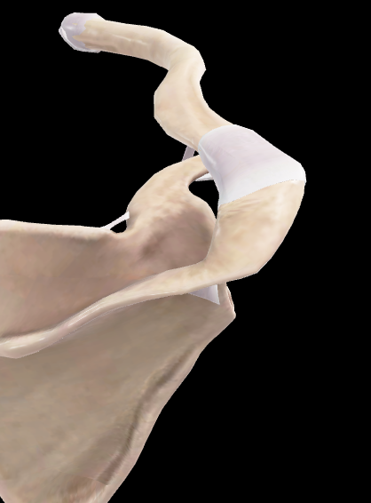
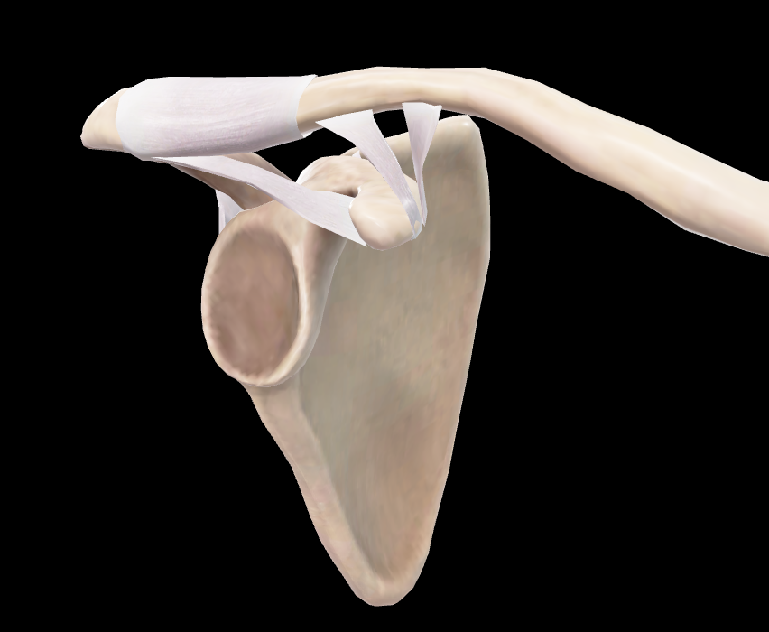
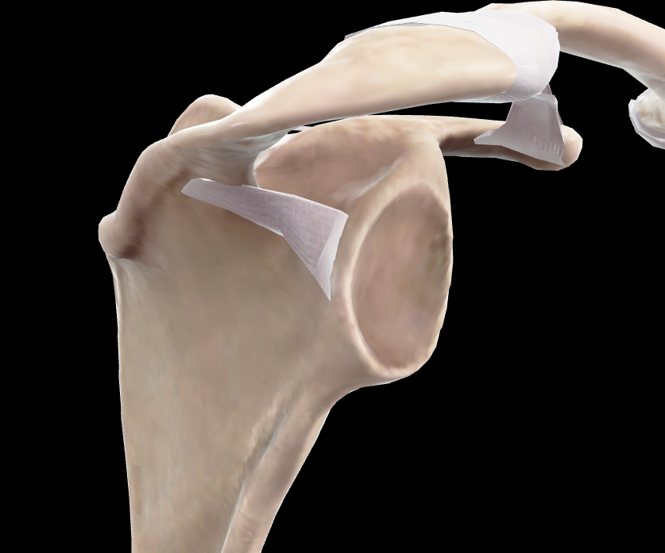

# Articulación Acromioclavicular

> Descripción breve: articulación plana que une el acromion con la extremidad acromial de la clavícula. Forma parte de la unión entre la clavícula y la escápula. (Rouvier)

## 📋 Datos Clave

- **Tipo:** sinovial, plana (artrodia)
- **Clasificación:** diartrosis
- **Movimientos:** deslizamiento
- **Estabilidad:** moderada, reforzada por ligamentos
- **Función:** unir clavícula a escápula, permitir movimientos de la cintura escapular

#articulacion #hombro #cintura-pectoral

---

## 📷 Imágenes de Referencia

*Vista superior-posterior de la articulación acromioclavicular*

*Vista lateral-anterior de la articulación acromioclavicular*

---

## Anatomía Descriptiva (Rouvier)

### Superficies Articulares

#### Superficie Acromial
- Ocupa la parte anterior del borde medial del acromion
- Tallada en bisel a expensas de la cara superior del acromion
- Orientada **superior y medialmente**
- Revestida por fibrocartílago (más grueso inferior que superiormente)

#### Superficie Clavicular
- Situada en la extremidad acromial de la clavícula
- Casi plana, elíptica, alargada de anterior a posterior
- Orientada **inversamente a la superficie acromial** (se apoya sobre ella)
- Revestida por fibrocartílago (más grueso superior que inferiormente)

### Características
- Las dos superficies son **casi planas, elípticas**
- Alargadas de **anterior a posterior** y un poco de **medial a lateral**
- La orientación inversa explica por qué la **luxación superior de la clavícula** es la más frecuente

---

## Medios de Unión (Rouvier)

### Cápsula Articular
- Manguito fibroso bastante grueso
- Se inserta en ambos huesos muy cerca del revestimiento fibrocartilaginoso
- Reforzada en su cara superior por el **ligamento acromioclavicular**

### Ligamento Acromioclavicular
- Muy fuerte, ocupa la cara superior de la articulación
- Comprende **dos planos fibrosos**:
  1. **Plano profundo:** engrosamiento de la propia cápsula articular
  2. **Plano superficial:** fascículos fibrosos oblicuos (anterior→posterior, lateral→medial)
- Puede separarse fácilmente de la cápsula en la mayoría de los casos

### Disco Articular
- No siempre presente
- Cuando existe, divide la articulación en dos cavidades
- De forma variable: completo, perforado o ausente

---

## Ligamento Coracoclavicular (Rouvier)

### Generalidades
- Une la clavícula a la apófisis coracoides
- Presenta **dos porciones bien diferenciadas**:
  1. **Ligamento trapezoideo** (anterior)
  2. **Ligamento conoideo** (posterior)

### Ligamento Trapezoideo
- **Inserción inferior:** mitad o tercio posterior del borde medial del segmento horizontal de la apófisis coracoides (cara superior y parte próxima)
- **Inserción superior:** segmento anterior de la línea trapezoidea de la clavícula
- **Forma:** lámina fibrosa cuadrilátera
- **Orientación:** plano oblicuo (superior→inferior, lateral→medial)
- **Caras:** anteromedial (orientada medial, anterior y superior) y posterolateral

### Ligamento Conoideo
- **Inserción inferior:** vértice de la apófisis coracoides
- **Inserción superior:** tubérculo conoideo de la clavícula
- **Forma:** cono fibroso con base inferior y vértice superior
- Más posterior y medial que el trapezoideo

---

## Vascularización

| Arteria | Territorio |
|---------|-----------|
| Ramas acromiales de la [[Arteria toracoacromial]] | irrigación principal |
| Ramas de la [[Arteria supraescapular]] | contribución |
| [por completar] | [por completar] |

---

## Inervación

| Nervio | Función |
|--------|---------|
| Ramos del [[Nervio supraescapular]] | inervación articular |
| Ramos del [[Plexo cervical]] | contribución |
| [por completar] | [por completar] |

---

## Movimientos

### Tipo de Movimientos
- **Principal:** deslizamiento (traslación)
- **Amplitud:** limitada
- **Ejes:** múltiples debido a superficie plana

### Movimientos Asociados
1. **Elevación/Descenso** de la escápula
2. **Protractión/Retractión** escapular
3. **Rotación** de la escápula

### Relación con Movimientos del Hombro
- Permite ajustes finos de la posición escapular
- Contribuye a la amplitud total del movimiento del hombro
- Estabiliza la relación clavícula-escápula durante movimientos del brazo

---

## Relaciones Anatómicas

### Superficiales
- **Piel** y **tejido celular subcutáneo**
- **Fascia** del [[Deltoides]] y [[Trapecio]]

### Profundas
- **Bursa subacromial** (inferior)
- **Tendón del [[Supraespinoso]]** (inferior)
- **Articulación glenohumeral** (inferior y lateral)

### Laterales
- [[Deltoides]] (fascículos anteriores)
- [[Acromion]]

### Mediales
- [[Clavícula]]
- [[Músculo trapecio]] (fascículos claviculares)

---

## Biomecánica

### Estabilidad
- **Estabilidad primaria:** ligamento coracoclavicular (especialmente conoideo)
- **Estabilidad secundaria:** cápsula y ligamento acromioclavicular
- **Mínima congruencia ósea** → dependencia ligamentosa

### Fuerzas
- **Tracción superior:** ligamento conoideo (principal estabilizador vertical)
- **Tracción anterior:** ligamento trapezoideo
- **Compresión:** superficies articulares y cápsula

---

## Variaciones Anatómicas

### Disco Articular
- **Tipo I:** disco completo (divide articulación)
- **Tipo II:** disco incompleto/perforado
- **Tipo III:** ausencia de disco

### Inserción Ligamentosa
- Variaciones en tamaño y orientación del ligamento coracoclavicular
- Diferencias en el desarrollo del tubérculo conoideo

### Superficies Articulares
- Variaciones en el grado de inclinación
- Diferencias en el tamaño y forma

---

## Notas Clínicas

### Luxación Acromioclavicular
- **Mecanismo:** caída sobre hombro o brazo aducido
- **Grados:**
  - **Grado I:** esguince ligamentoso (AC)
  - **Grado II:** ruptura ligamento AC, estiramiento CC
  - **Grado III:** ruptura completa AC y CC
  - **Grados IV-VI:** desplazamientos mayores
- **Signo de la tecla:** elevación de extremidad clavicular al presionar

### Artrosis Acromioclavicular
- **Causa:** degeneración articular por uso/edad
- **Síntomas:** dolor localizado, crepitación, limitación movimiento
- **Diagnóstico:** radiografía, dolor a la palpación, prueba de cross-arm

### Osteólisis Distal de Clavícula
- **Causa:** microtraumatismos repetidos (levantadores de peso)
- **Hallazgo:** reabsorción ósea de extremidad distal de clavícula
- **Tratamiento:** reposo, modificación actividad, eventual resección distal

---

## Tabla de Imágenes

| Imagen | Vista | Descripción |
|--------|-------|-------------|
|  | Superior-posterior | Vista superior-posterior de la articulación |
|  | Lateral-anterior | Vista lateral-anterior de la articulación |
|  | Lateral-anterior sin cápsula | Vista lateral-anterior sin cápsula articular |
|  | Posterior-lateral | Vista posterior-lateral de la articulación |

---

## 🔗 Fuente
- Rouvier-Anatomía Humana, Tomo 3