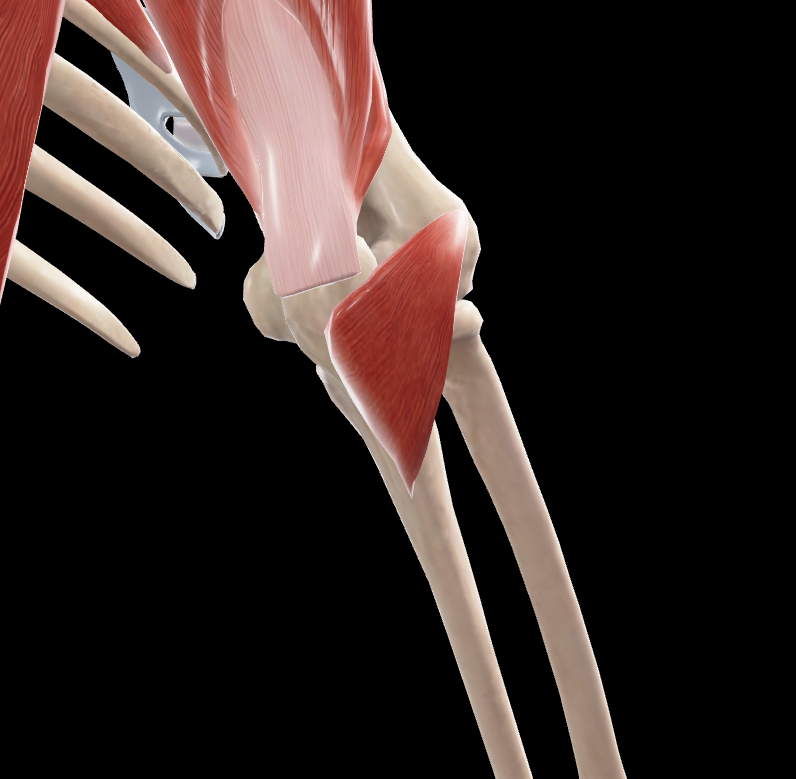
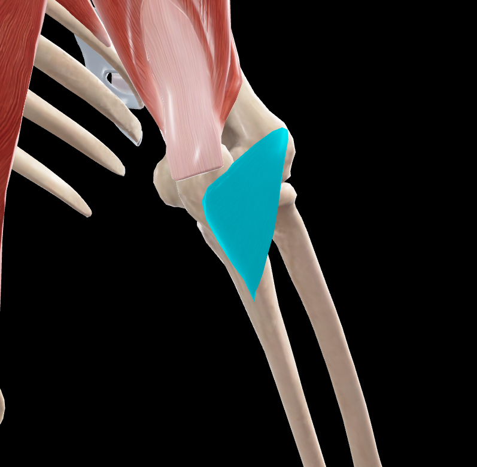

# Anconeo

> Músculo corto y triangular situado en la cara posterior del codo

#musculo #cintura-pectoral #brazo

## 📋 Datos Clave
- **Grupo:** Músculos posteriores del antebrazo (capa superficial)
- **Función principal:** Extensor del antebrazo
- **Inervación:** [[Nervio radial]] (rama del nervio de la cabeza medial del tríceps braquial)

## 📷 Imágenes de Referencia

*Vista posterior del músculo*

*Vista posterior seleccionada*

## Origen
- **Vértice y parte posterior del epicóndilo lateral** del húmero
- Posteriormente al tendón común de los músculos epicondíleos laterales
- Por medio de un tendón propio

## Inserción
- **Cara lateral del olécranon** del cúbito
- **Tercio superior de la cara posterior del cúbito:** En una superficie triangular y cóncava

## Relaciones
- Situado en la cara posterior del codo
- Entre el músculo extensor cubital del carpo (inferior y lateralmente)
- Y la cabeza medial del músculo tríceps braquial (superiormente)
- Cubre la cara posterior de la articulación humerorradial
- Cubre la parte posterior del músculo supinador

## Vascularización
- Arteria interósea recurrente
- Arteria colateral radial
- Ramas de la arteria braquial profunda

## Inervación
- Nervio radial (C7-C8)
- Rama específica: nervio del músculo ancóneo, que es un ramo del nervio de la cabeza medial del tríceps braquial

## Funciones
1. **Extensión del antebrazo:** Sobre el brazo (acción principal)
2. **Estabilización:** De la articulación del codo durante la extensión
3. **Asistencia:** Al tríceps braquial en la extensión del codo
4. **Protección:** De la articulación humerorradial

## Características especiales
- Músculo pequeño pero funcionalmente importante
- Considerado una prolongación del tríceps braquial
- Sus fibras superiores son casi transversales
- Sus fibras inferiores son oblicuas, más cuanto más inferiormente se sitúan
- Añade aproximadamente 0,8 kg de fuerza a la extensión del codo
- Forma parte del grupo de músculos epicondíleos laterales

## 🔗 Fuente
- Rouvier-Anatomía Humana, Tomo 3