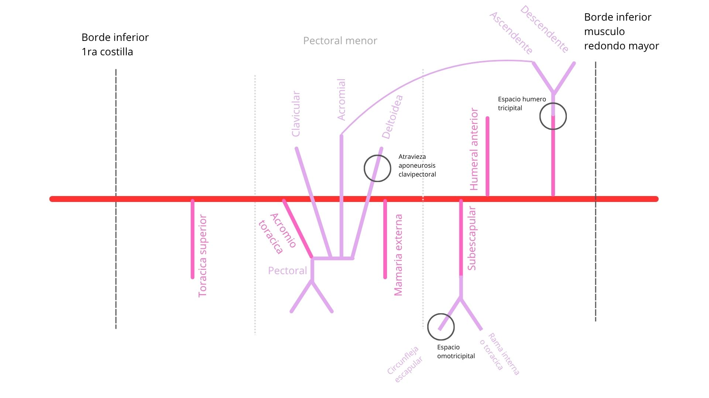

# Arteria Axilar

> #arteria #axila #cintura-pectoral

## 📷 Imágenes de Referencia

*Diagrama de la arteria axilar y sus ramas*

## Clasificación por porciones

### 1ra porción (medial al pectoral menor)
- **Arteria torácica superior**

### 2da porción (posterior al pectoral menor)
- **Arteria toracoacromial (tronco toracoacromial)**
	- Rama clavicular
		- Irriga principalmente al músculo subclavio
	- Rama acromial
		- Se anastomosa con la rama ascendente de la arteria circunfleja humeral posterior
	- Rama deltoidea
		- Perfora la aponeurosis clavipectoral
	- Rama pectoral
		- Irriga al pectoral mayor y menor
- **Arteria torácica lateral (mamaria externa)**
	- Ayuda a irrigar la pared torácica y la mama

### 3ra porción (lateral al pectoral menor)
- **Arteria subescapular** (la más gruesa de toda la axilar)
	- **Arteria toracodorsal**
		- Acompaña al nervio y al músculo dorsal ancho
	- **Arteria circunfleja de la escápula**
		- Bordea el borde lateral de la escápula
		- Pasa por el **espacio triangular (omotricipital)**
- **Arteria circunfleja humeral anterior**
- **Arteria circunfleja humeral posterior**
	- Atraviesa el **espacio cuadrangular (humerotricipital)**
	- Se subdivide en:
		- Rama ascendente: se anastomosa con la rama acromial de la arteria toracoacromial
		- Rama descendente: se anastomosa con una rama de la arteria braquial, la arteria braquial profunda

## Anastomosis relevantes
- Rama acromial de la toracoacromial ↔ Rama ascendente de la circunfleja humeral posterior
- Rama descendente de la circunfleja humeral posterior ↔ Arteria braquial profunda
- Arteria circunfleja de la escápula ↔ Arterias supraescapular y dorsal de la escápula (de la subclavia) 

## Enlaces
- [[Toracica superior]]
- [[Toracoacromial]]
- [[Toracica lateral]]
- [[Subescapular]]
- [[Circunfleja humeral anterior]]
- [[Circunfleja humeral posterior]]

## Nervios relacionados
- [[Plexo braquial]]
- [[Nervio axilar]]
- [[Nervio radial]]
- [[Nervio mediano]]
- [[Nervio musculocutáneo]]
- [[Nervio cubital]]

