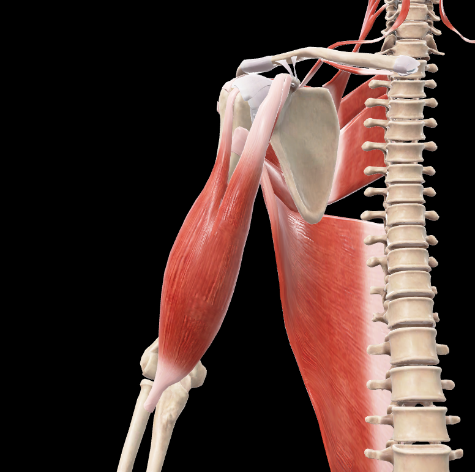
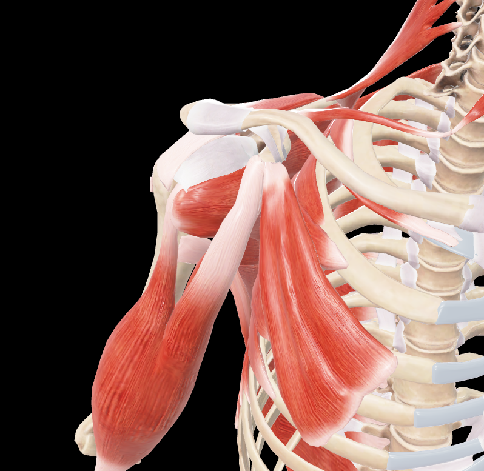
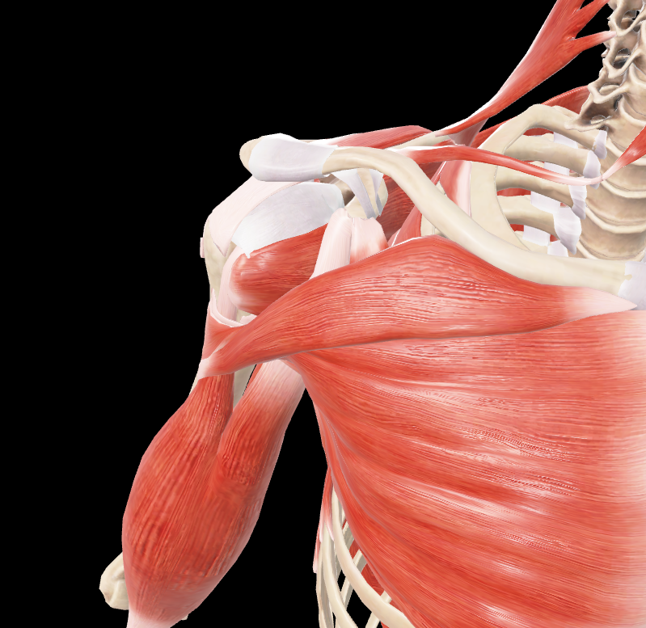
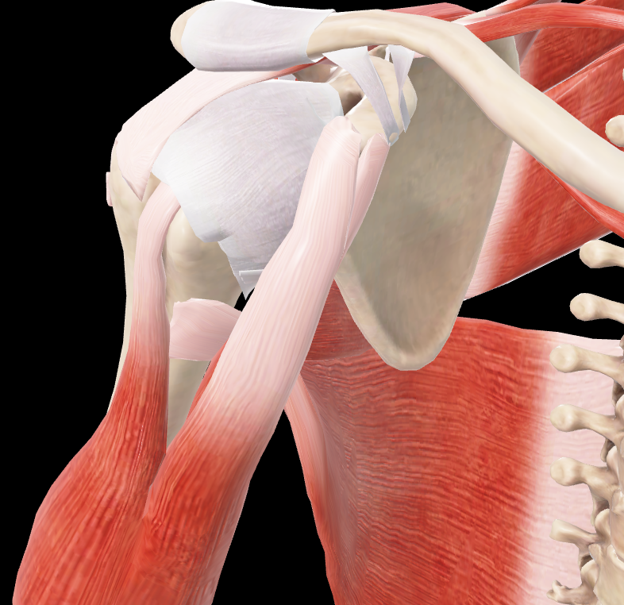
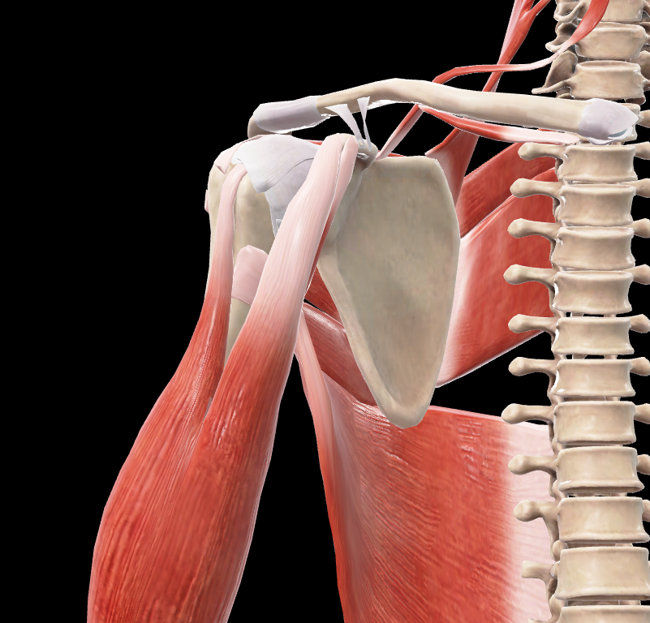
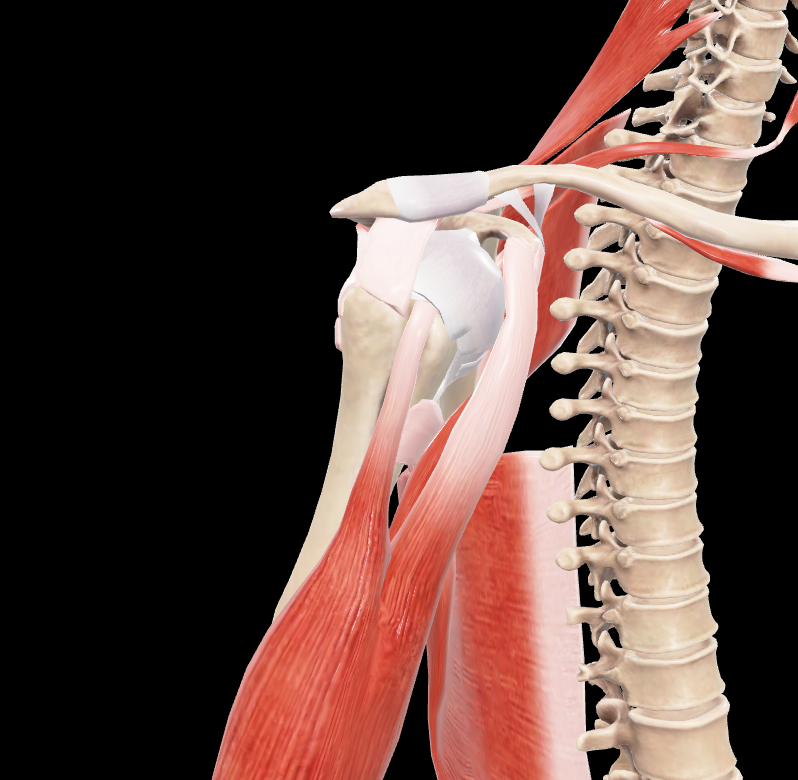
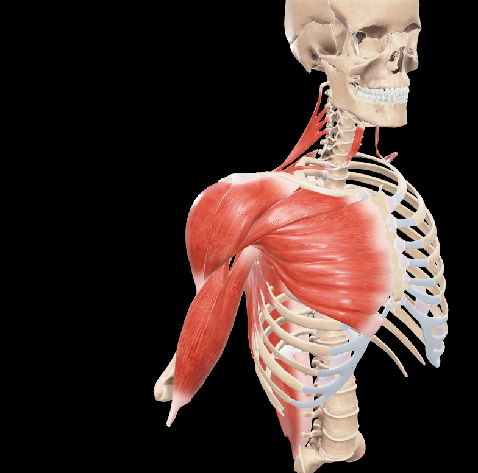

# Bíceps Braquial

> Músculo alargado y fusiforme situado anteriormente en el brazo, con dos cabezas de origen

#musculo #cintura-pectoral #brazo

## 📋 Datos Clave
- **Grupo:** Músculos anteriores del brazo
- **Función principal:** Flexor del antebrazo sobre el brazo y supinador
- **Inervación:** [[Nervio musculocutáneo]]

## 📷 Imágenes de Referencia

*Vista anterior del músculo*

*Vista anterior-lateral agrupada*

*Vista con pectoral tapando*

*Zoom anterior-lateral*

*Zoom anterior*

*Vista lateral*

*Vista lateral con deltoides tapando*

## Origen
**Cabeza corta:** 
- Cara lateral del vértice de la apófisis coracoides de la escápula
- Por medio de un tendón que se une al del músculo coracobraquial

**Cabeza larga:**
- Parte más superior del rodete glenoideo
- Reborde de la cavidad glenoidea de la escápula
- Por medio de un tendón cilíndrico que se divide en dos ramas

## Inserción
1. **Tendón principal:** Mitad posterior de la tuberosidad del radio
   - Separado por una bolsa sinovial de la mitad anterior de la tuberosidad
2. **Aponeurosis del bíceps braquial (lacertus fibrosus):**
   - Se separa del borde medial y cara anterior del tendón
   - Se confunde con la fascia de los músculos epicondíleos mediales

## Relaciones
- Situado anterior a los músculos coracobraquial y braquial
- **Cabeza corta:** Situada superiormente en la axila, anterior a tendones de subescapular, dorsal ancho y redondo mayor, posterior al pectoral mayor
- **Cabeza larga:** Atraviesa la articulación del hombro, recorre el surco intertubercular
- Las dos cabezas se unen hacia la parte media del brazo formando un cuerpo muscular único

## Vascularización
- Arteria braquial
- Arteria circunfleja humeral anterior
- Ramas de la arteria axilar

## Inervación
- Nervio musculocutáneo (C5-C7)

## Funciones
1. **Flexión del antebrazo:** Sobre el brazo (acción principal)
2. **Supinación:** Cuando actúa sobre el antebrazo en pronación, lo sitúa primero en supinación y después lo flexiona
3. **Flexión del brazo:** Participa en la flexión del brazo sobre el hombro (cabeza larga)
4. **Estabilización:** De la articulación del hombro (cabeza larga)

## Características especiales
- Músculo biarticular: Cruza las articulaciones del hombro y codo
- El tendón de la cabeza larga está envuelto por una vaina sinovial en el surco intertubercular
- Presenta una aponeurosis bicipital que se continúa con la fascia antebraquial

## 🔗 Fuente
- Rouvier-Anatomía Humana, Tomo 3