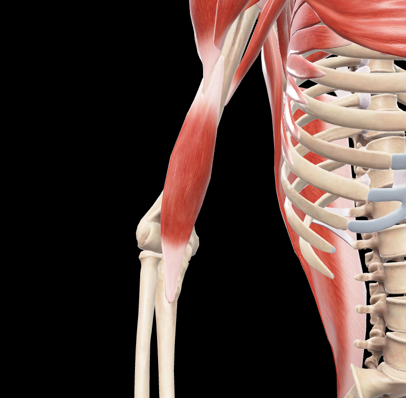
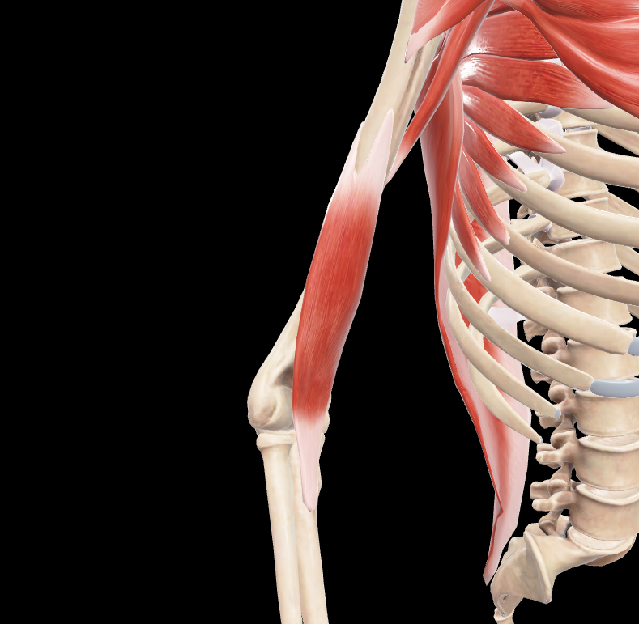
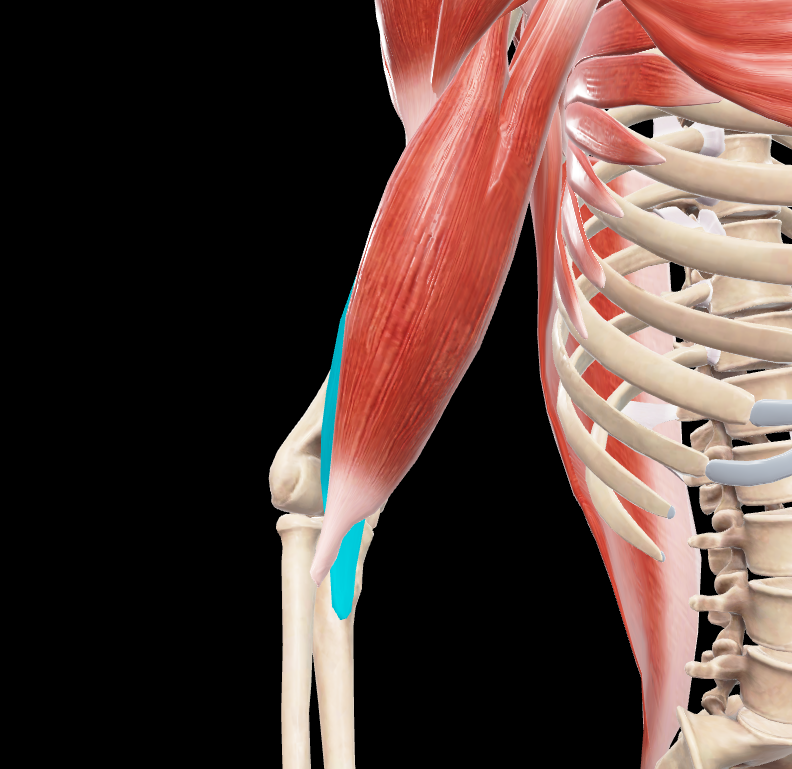

# Braquial

> Músculo ancho, aplanado y voluminoso situado anterior al húmero y a la articulación del codo

#musculo #cintura-pectoral #brazo

## 📋 Datos Clave
- **Grupo:** Músculos anteriores del brazo
- **Función principal:** Flexor del antebrazo sobre el brazo
- **Inervación:** [[Nervio musculocutáneo]] y [[Nervio radial]]

## 📷 Imágenes de Referencia

*Vista anterior del músculo*

*Vista anterior sin deltoides*

*Vista anterior tapada y seleccionada*

## Origen
Se inserta en:
1. **Borde anterior y caras anteromedial y anterolateral del húmero:** 
   - Inferiormente a las inserciones de los músculos deltoides y coracobraquial
   - La inserción se prolonga un poco superiormente entre las inserciones del deltoides lateralmente y del coracobraquial medialmente
2. **Cara anterior de los tabiques intermusculares medial y lateral del brazo:**
   - No en toda su extensión
   - En el tabique intermuscular lateral solo a la altura del músculo deltoides
   - Inferiormente separado del tabique por el músculo braquiorradial

## Inserción
- **Tendón ancho y aplanado:** Se inserta en la parte inferomedial de la cara inferior de la apófisis coronoides del cúbito
- **Límite inferior de la inserción:** Alargado y dirigido oblicuamente en sentido inferior y lateral

## Relaciones
- Situado inferior al músculo coracobraquial
- Anterior a la parte inferior del húmero y a la articulación del codo
- Cubierto anteriormente por el músculo bíceps braquial
- Da origen a una expansión tendinosa a la altura del codo que cruza el surco bicipital lateral y termina en la fascia del antebrazo

## Vascularización
- Arteria braquial
- Arteria braquial profunda
- Arterias colaterales

## Inervación
- **Principal:** Nervio musculocutáneo (C5-C7)
- **Accesoria:** Nervio radial (C5-C8) para los fascículos más laterales

## Funciones
1. **Flexión del antebrazo:** Sobre el brazo (acción principal)
2. **Flexión pura del codo:** Independiente de la posición de pronación/supinación
3. **Estabilización:** De la articulación del codo durante la flexión

## Características especiales
- Músculo monoarticular: Actúa solo sobre la articulación del codo
- Considerado el flexor puro del codo, ya que no participa en movimientos de pronación/supinación
- Más potente que el bíceps braquial en flexión del codo cuando el antebrazo está pronado
- Su expansión tendinosa en el codo refuerza la fascia antebraquial

## 🔗 Fuente
- Rouvier-Anatomía Humana, Tomo 3