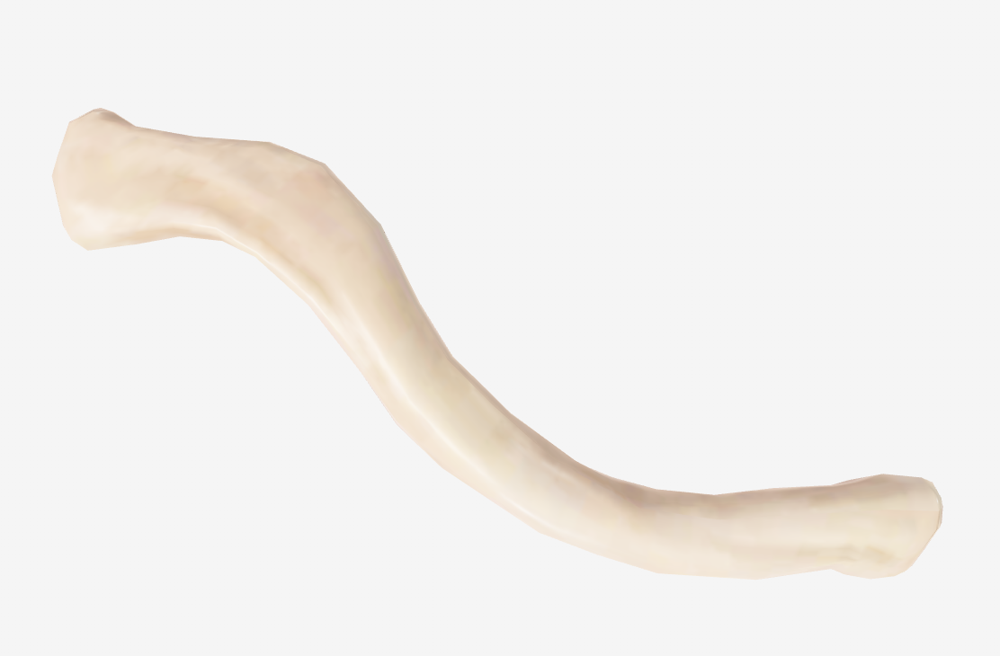
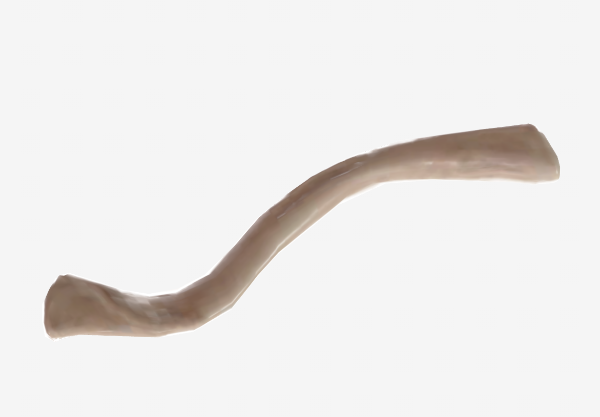

# Clavícula

> Descripción breve: hueso largo situado en la parte anterosuperior del tórax. Se extiende del esternón al acromion, siguiendo una dirección oblicua lateral y posteriormente. Tiene la forma de una S cursiva. (Rouvier)

## 📋 Datos Clave

- **Tipo:** largo
- **Región:** #cintura-pectoral
- **Elemento del esqueleto:** apendicular
- **Formación:** endoescondral (dos centros: uno primario y otro secundario)
- **Función principal:** unir el miembro superior al tórax, servir como punto de inserción muscular

#hueso #clavicula #hombro

---

## 📷 Imágenes de Referencia

*Vista superior de la clavícula*

*Vista inferior de la clavícula*

---

## Partes / Accidentes Óseos (Rouvier)

### Forma General
- Tiene la forma de una **S cursiva**
- Describe dos curvaturas:
  - **Medial:** cóncava posteriormente
  - **Lateral:** menos extensa, cóncava anteriormente
- Está **aplanada de superior a inferior** (más acentuado lateralmente)

### Caras
1. **Cara superior:** lisa en casi toda su extensión. Presenta rugosidades inconstantes para inserciones musculares.
2. **Cara inferior:** excavada en su parte media por el **surco del músculo subclavio**. Contiene:
   - Agujero nutricio del hueso
   - Impresión del ligamento costoclavicular (extremo esternal)
   - Tuberosidad del ligamento coracoclavicular (extremo acromial)

### Bordes
1. **Borde anterior:** en sus dos tercios mediales es grueso, convexo y ligeramente áspero (inserción del [[Músculo pectoral mayor]]). Tercio lateral cóncavo y delgado (inserción del [[Deltoides]]).
2. **Borde posterior:** grueso, cóncavo y liso en sus dos tercios mediales; lateralmente convexo y rugoso (inserción del [[Trapecio]]).

### Extremidades
1. **Extremidad acromial:** aplanada de superior a inferior. Presenta cara articular elíptica para la articulación con el acromion.
2. **Extremidad esternal:** presenta superficie articular para el esternón y el primer cartílago costal.

### Arquitectura Ósea (Rouvier)
- Formada por una **vaina de tejido óseo compacto**, muy gruesa en la parte media
- Tejido óseo compacto rodea el **tejido óseo esponjoso**
- En la parte media puede aparecer un esbozo de cavidad medular

---

## Articulaciones

| Extremidad | Articulación | Tipo | Movimientos |
|------------|-------------|------|-------------|
| Acromial | [[Acromioclavicular]] | plana | movimientos de deslizamiento |
| Esternal | [[Esternoclavicular]] | [por completar] | [por completar] |

---

## Inserciones Musculares (Rouvier)

### Origen (fijo, menos móvil)
| Músculo | Localización en el hueso |
|---------|-------------------------|
| [[Músculo subclavio]] | surco del músculo subclavio (cara inferior) |

### Inserción (más móvil)
| Músculo | Localización en el hueso |
|---------|-------------------------|
| [[Deltoides]] | tercio lateral del borde anterior, fascículos anteriores |
| [[Trapecio]] | borde posterior, fascículos claviculares |
| [[Músculo pectoral mayor]] | dos tercios mediales del borde anterior |
| [[Músculo esternocleidomastoideo]] | cara superior medial |

---

## Ligamentos

| Ligamento | Inserción en la clavícula |
|-----------|--------------------------|
| Ligamento costoclavicular | impresión en cara inferior (extremo esternal) |
| Ligamento trapezoideo | línea trapezoidea (parte anterior de tuberosidad coracoclavicular) |
| Ligamento conoideo | tubérculo conoideo (parte posterior de tuberosidad coracoclavicular) |

---

## Vascularización

| Arteria | Territorio |
|---------|-----------|
| [por completar] | [por completar] |

---

## Inervación

| Nervio | Función |
|--------|---------|
| [por completar] | [por completar] |

---

## Relaciones Anatómicas

- **Superior:** piel, fascia, músculos ([[Deltoides]], [[Trapecio]])
- **Inferior:** [[Músculo subclavio]], [[Plexo braquial]], [[Vena subclavia]]
- **Medial:** [[Esternón]], primera costilla
- **Lateral:** [[Acromion]], [[Articulación acromioclavicular]]

---

## Relaciones con Órganos / Vísceras

| Estructura | Relación |
|-----------|----------|
| [[Pulmón]] | inferior y posterior, separado por músculos y fascia |
| [[Vena subclavia]] | inferior, en el triángulo clavipectoral |

---

## Osificación (Rouvier)

- **Centro primario:** aparece al final del primer mes de desarrollo
- **Centro secundario:** se desarrolla en la cara articular esternal hacia los 18 años
- **Fusión:** el centro secundario se suelda al resto del hueso hacia los 25 años

---

## Notas Clínicas

- **Fracturas de clavícula:** comunes por caídas sobre el hombro o brazo extendido
- **Luxación acromioclavicular:** frecuente en deportes de contacto
- **Síndrome del desfiladero torácico:** compresión de estructuras neurovasculares entre clavícula y primera costilla

---

## Tabla de Imágenes

| Imagen | Vista | Descripción |
|--------|-------|-------------|
|  | Superior | Vista superior de la clavícula |
|  | Inferior | Vista inferior de la clavícula |

---

## 🔗 Fuente
- Rouvier-Anatomía Humana, Tomo 3