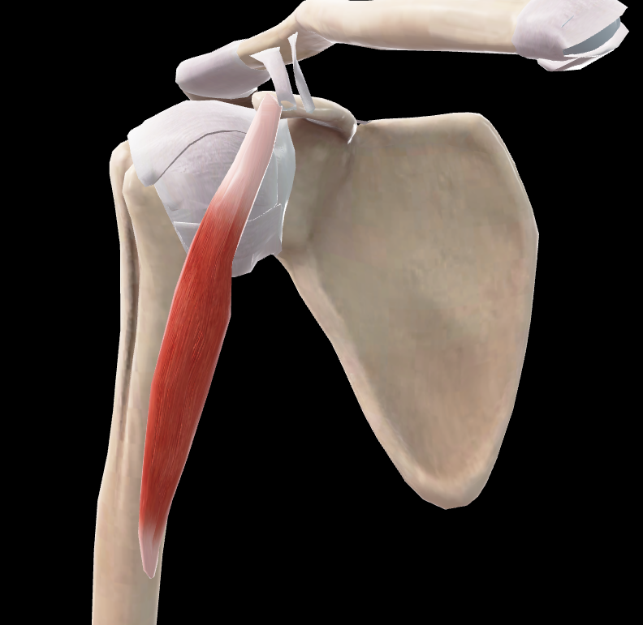

# Coracobraquial

> Músculo alargado y aplanado situado en la parte superior y medial del brazo

#musculo #cintura-pectoral #brazo

## 📋 Datos Clave
- **Grupo:** Músculos anteriores del brazo
- **Función principal:** Desplazar el brazo anterior y medialmente
- **Inervación:** [[Nervio musculocutáneo]]

## 📷 Imágenes de Referencia

*Vista anterior del músculo*

## Origen
- **Lado medial del vértice de la apófisis coracoides** de la escápula
- Por medio de un tendón que es común con el de la cabeza corta del músculo bíceps braquial

## Inserción
- **Cara anteromedial del húmero**
- En una superficie rugosa un poco superiormente a la parte media del hueso
- Anteriormente al borde medial del húmero
- Por medio de un tendón corto y aplanado

## Relaciones
- Se dirige inferior y un poco lateralmente
- Atraviesa la axila posterior al músculo pectoral mayor
- Anterior al tendón del músculo subescapular (separado por una bolsa sinovial)
- Anterior a los tendones de los músculos dorsal ancho y redondo mayor
- A menudo dividido hacia la mitad de su trayecto en dos fascículos por un intersticio atravesado por el nervio musculocutáneo (músculo perforado de Casserius)

## Vascularización
- Arteria circunfleja humeral anterior
- Arteria braquial
- Ramas de la arteria axilar

## Inervación
- Nervio musculocutáneo (C5-C7)
- Suele recibir dos ramos del nervio musculocutáneo

## Funciones
1. **Flexión del brazo:** Sobre el hombro
2. **Aducción del brazo:** Aproxima el brazo al tronco
3. **Rotación medial leve:** Del brazo
4. **Estabilización:** De la articulación del hombro

## Características especiales
- Forma parte del plano profundo de los músculos anteriores del brazo
- Comparte tendón de origen con la cabeza corta del bíceps braquial
- Es perforado por el nervio musculocutáneo en su trayecto
- Considerado un músculo de transición entre la cintura escapular y el brazo

## 🔗 Fuente
- Rouvier-Anatomía Humana, Tomo 3