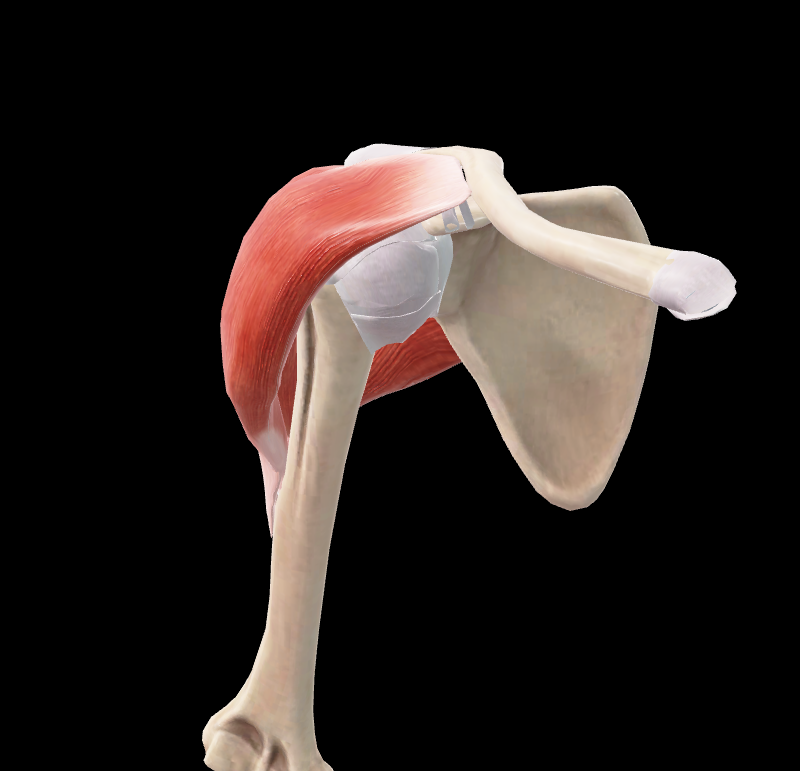
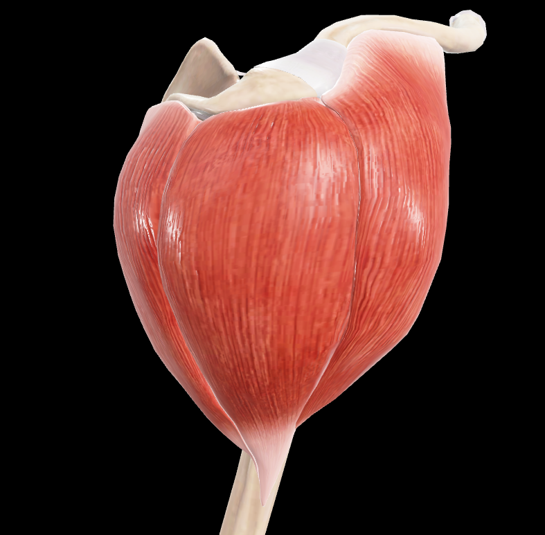
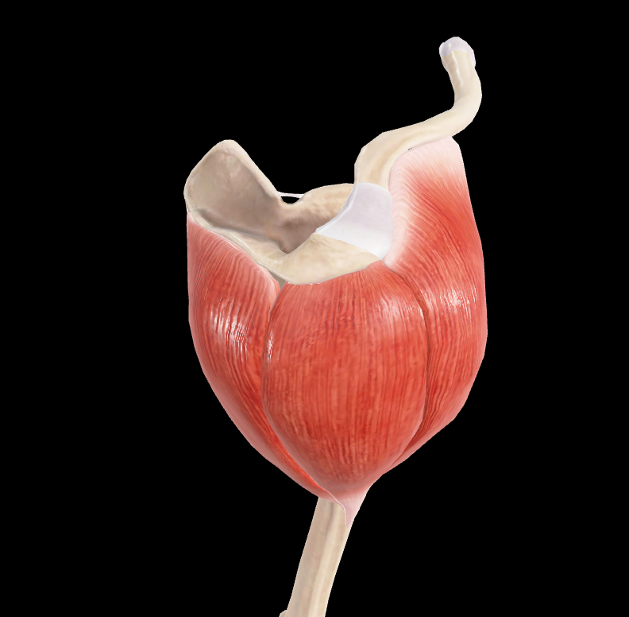
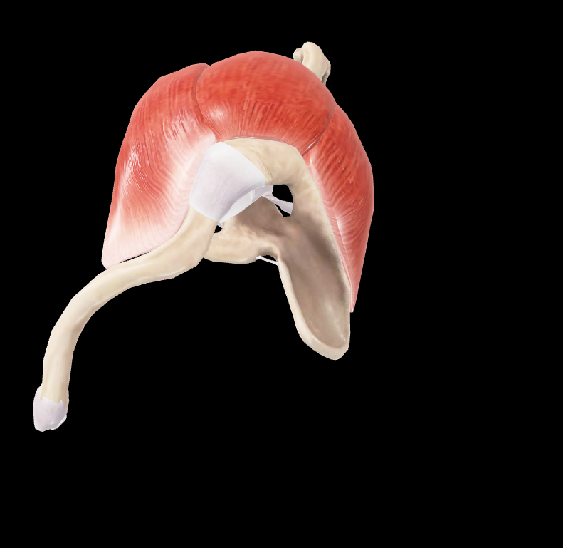

# Músculo Deltoides

> Descripción breve: músculo voluminoso y grueso, en forma de semicono hueco con la base situada superiormente y el vértice en la parte inferior. Está situado en la parte lateral del hombro. Es el músculo que configura el muñón del hombro. Une la cintura del miembro superior a la cara lateral del húmero. (Rouvier)

#musculo #cintura-pectoral #hombro

## 📋 Datos Clave

- **Grupo muscular:** músculos del hombro
- **Inervación:** [[Nervio axilar]] (C5-C6)
- **Vascularización:** [[Arteria circunfleja humeral posterior]], ramas de la [[Arteria toracoacromial]]
- **Función principal:** abducción del brazo (0-90°), flexión (porción anterior), extensión (porción posterior)

#musculo #cintura-pectoral #hombro
- **Sinergistas:** [[Supraespinoso]] (abducción inicial), [[Trapecio]] (abducción >90°)
- **Antagonistas:** [[Pectoral Mayor]], [[Dorsal Ancho]], [[Redondo Mayor]] (aducción)

---

## 📷 Imágenes de Referencia

*Vista anterior del músculo deltoides*

*Vista lateral del músculo deltoides*

---

## Anatomía Descriptiva (Rouvier)

### Forma, Situación y Trayecto
- **Forma:** semicono hueco con base superior y vértice inferior
- **Situación:** parte lateral del hombro
- **Trayecto:** desde cintura escapular hasta cara lateral del húmero
- **Configura:** el muñón del hombro

### Inserciones (Rouvier)

#### Inserción Superior (origen)
Sigue una línea curva de concavidad medial:

1. **Clavícula:**
   - Tercio lateral del borde anterior
   - Parte de la cara superior del hueso próxima a dicho borde
   - **Medio de inserción:** cortas fibras tendinosas

2. **Acromion:**
   - Vértice del acromion
   - Borde lateral del acromion
   - **Medio de inserción:** tres o cuatro láminas tendinosas que descienden entre los fascículos musculares por medio de cortas fibras tendinosas situadas en los intervalos entre las láminas

3. **Espina de la escápula:**
   - Vertiente inferior del borde posterior de la espina
   - **Medio de inserción:** lámina tendinosa gruesa y corta, en la cual se implantan también los fascículos más superiores del [[Infraespinoso]]

#### Características de las Inserciones Superiores
- **Láminas tendinosas acromiales:** dan nacimiento por sus dos caras a las fibras musculares, formando con ellas fascículos penniformes
- **Disposición de fibras:**
  - **Anteriores:** descienden de anterior a posterior
  - **Medias:** descienden verticalmente
  - **Posteriores:** descienden de posterior a anterior

#### Inserción Inferior
- **Localización:** parte media de la cara lateral del húmero
- **Estructura:** tuberosidad deltoidea
- **Medio de inserción:** masa tendinosa que puede dividirse en tres tendones:

1. **Tendón anterior:**
   - Formado por las fibras de la porción clavicular
   - Se fija en la rama anterior de la tuberosidad

2. **Tendón posterior:**
   - Continuación de las fibras que proceden de la espina de la escápula
   - Se inserta en la rama posterior de la tuberosidad

3. **Tendón medio:**
   - Ocupa la posición media
   - Formado por los fascículos acromiales
   - Se inserta entre los dos tendones precedentes
   - **Disposición:** penniforme análoga a los que nacen en el acromion

### Relaciones Anatómicas

#### Cubre (superficialmente)
- Articulación del hombro
- Músculos periarticulares en su inserción cercana a la cabeza del húmero:
  - **Anteriormente:** [[Pectorales]] y [[Subescapular]]
  - **Superiormente:** [[Supraespinoso]]
  - **Posteriormente:** [[Infraespinoso]], [[Redondo Menor]] y [[Redondo Mayor]]

#### Relación con Tabique Intermuscular Lateral
- Entre los fascículos anteriores del deltoides, los más superficiales se fijan a lo largo de la rama anterior de la tuberosidad deltoidea en el **tabique intermuscular lateral del brazo**
- Este tabique está constituido por una lámina fibrosa en cuya cara opuesta se insertan fibras del [[Braquial]]

#### Espacio Deltopectoral (Triángulo Deltopectoral)
- Entre porción clavicular del deltoides y porción clavicular del pectoral mayor
- **Contenido:**
  - [[Vena cefálica]]
  - Ramos del [[Nervio supraclavicular]]
  - Ramos de la [[Arteria toracoacromial]]

---

## Porciones del Deltoides

### 1. Porción Clavicular (Anterior)
- **Origen:** tercio lateral de la clavícula
- **Fibras:** orientadas oblicuamente de superior-anterior a inferior-posterior
- **Función:** flexión y rotación medial del brazo
- **Inervación:** ramo anterior del nervio axilar

### 2. Porción Acromial (Media)
- **Origen:** acromion
- **Fibras:** orientadas verticalmente
- **Función:** abducción del brazo
- **Inervación:** ramo medio del nervio axilar
- **Característica:** disposición penniforme

### 3. Porción Espinal (Posterior)
- **Origen:** espina de la escápula
- **Fibras:** orientadas oblicuamente de superior-posterior a inferior-anterior
- **Función:** extensión y rotación lateral del brazo
- **Inervación:** ramo posterior del nervio axilar

---

## Inervación (Rouvier)

### Nervio Axilar (C5-C6)
- **Origen:** ramo posterior del [[Plexo braquial]]
- **Recorrido:** pasa por el espacio cuadrilátero junto con la arteria circunfleja humeral posterior
- **Ramos:**
  1. **Ramo anterior:** inerva porción clavicular
  2. **Ramo medio:** inerva porción acromial
  3. **Ramo posterior:** inerva porción espinal
- **Ramo cutáneo:** nervio cutáneo lateral superior del brazo (inerva piel sobre deltoides)

---

## Vascularización

### Arterias
1. **[[Arteria circunfleja humeral posterior]]:**
   - Principal irrigación
   - Acompaña al nervio axilar por espacio cuadrilátero
   - Ramas musculares para deltoides

2. **[[Arteria toracoacromial]]:**
   - Rama acromial
   - Rama deltoidea
   - Irriga porción superior

3. **[[Arteria circunfleja humeral anterior]]:**
   - Contribuye a irrigación anterior
   - Anastomosis con ramas posteriores

### Venas
- **Venae comitantes** de las arterias mencionadas
- **Drenaje:** hacia vena axilar
- **Vena cefálica:** pasa por triángulo deltopectoral

---

## Función y Biomecánica

### Movimientos Principales

#### Abducción (0-180°)
- **0-15°:** [[Supraespinoso]] (iniciador)
- **15-90°:** Porción acromial del deltoides (principal)
- **>90°:** Requiere rotación escapular ([[Trapecio]] y [[Serrato Anterior]])
- **Máxima eficiencia:** 90° de abducción

#### Flexión (0-180°)
- **Porción clavicular** del deltoides
- **Sinergistas:** [[Pectoral Mayor]] (porción clavicular), [[Coracobraquial]]
- **Amplitud:** 180°

#### Extensión (0-60°)
- **Porción espinal** del deltoides
- **Sinergistas:** [[Redondo Mayor]], [[Dorsal Ancho]]
- **Amplitud:** 60°

#### Rotación Medial
- **Porción clavicular** del deltoides
- **Amplitud limitada**
- **Sinergistas:** [[Subescapular]], [[Pectoral Mayor]]

#### Rotación Lateral
- **Porción espinal** del deltoides
- **Amplitud limitada**
- **Sinergistas:** [[Infraespinoso]], [[Redondo Menor]]

### Acciones Combinadas
- **Circunducción:** secuencia de todas las acciones anteriores
- **Estabilización** de la articulación glenohumeral durante movimientos del brazo
- **Protección** de estructuras articulares subyacentes

### Mecánica
- **Palanca de tercer género:** inserción cercana a la articulación
- **Ventaja mecánica:** para velocidad y amplitud, no para fuerza
- **Eficiencia máxima:** en abducción 90° (brazo perpendicular al cuerpo)

---

## Relaciones Clínicas

### Puntos de Referencia
1. **Tuberosidad deltoidea:** palpable en cara lateral del brazo
2. **Espacio deltopectoral:** para acceso quirúrgico a articulación del hombro
3. **Borde anterior del deltoides:** límite lateral de la región deltopectoral

### Inyecciones Intramusculares
- **Sitio común** para inyecciones
- **Zona segura:** tercio medio del músculo (evita nervio axilar y vasos)
- **Técnica:** ángulo de 90°, en masa muscular gruesa

### Lesiones del Nervio Axilar
- **Causas:** luxación glenohumeral, fractura de cuello quirúrgico, compresión
- **Manifestaciones:**
  - Debilidad/parálisis de abducción (0-90°)
  - Atrofia del deltoides (signo del hombro cuadrado)
  - Pérdida de sensibilidad sobre deltoides
- **Prueba:** abducción contra resistencia

### Atrofia del Deltoides
- **Causas:** lesión nerviosa, desuso, patologías neuromusculares
- **Signo:** pérdida de contorno redondeado del hombro
- **Consecuencia:** debilidad en abducción, dificultad para actividades sobre la cabeza

### Miositis Osificante
- **Formación de hueso** en el músculo tras trauma
- **Localización común:** porción anterior del deltoides
- **Causa:** contusiones repetidas (deportes de contacto)
- **Tratamiento:** reposo, antiinflamatorios, eventual extirpación

### Ruptura del Deltoides
- **Rara** debido a su robustez
- **Mecanismo:** trauma directo violento
- **Localización:** generalmente en inserción humeral
- **Tratamiento:** quirúrgico (reparación tendinosa)

---

## Tabla de Imágenes

| Imagen | Vista | Descripción |
|--------|-------|-------------|
|  | Anterior | Vista anterior del músculo deltoides |
|  | Lateral | Vista lateral del músculo deltoides |
|  | Lateral superior | Vista lateral superior del músculo deltoides |
|  | Posterior | Vista posterior del músculo deltoides |
|  | Superior | Vista superior del músculo deltoides |

---

## 🔗 Fuente
- Rouvier-Anatomía Humana, Tomo 3

## 🔗 Enlaces
- [[Fascia deltoidea]]
- [[Nervio axilar]]