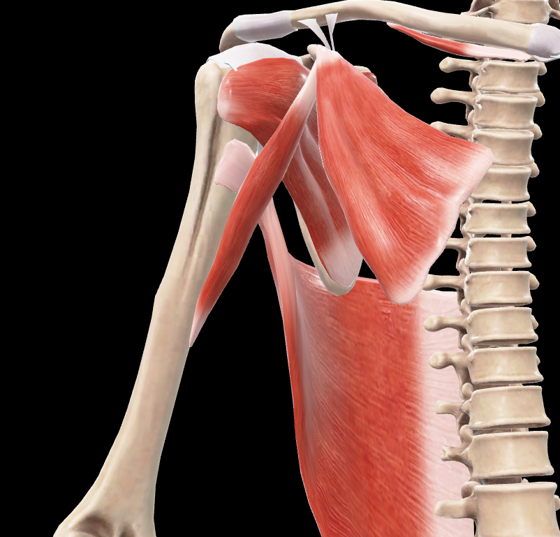
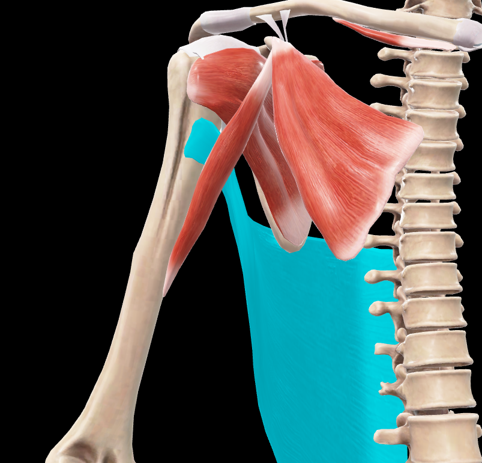
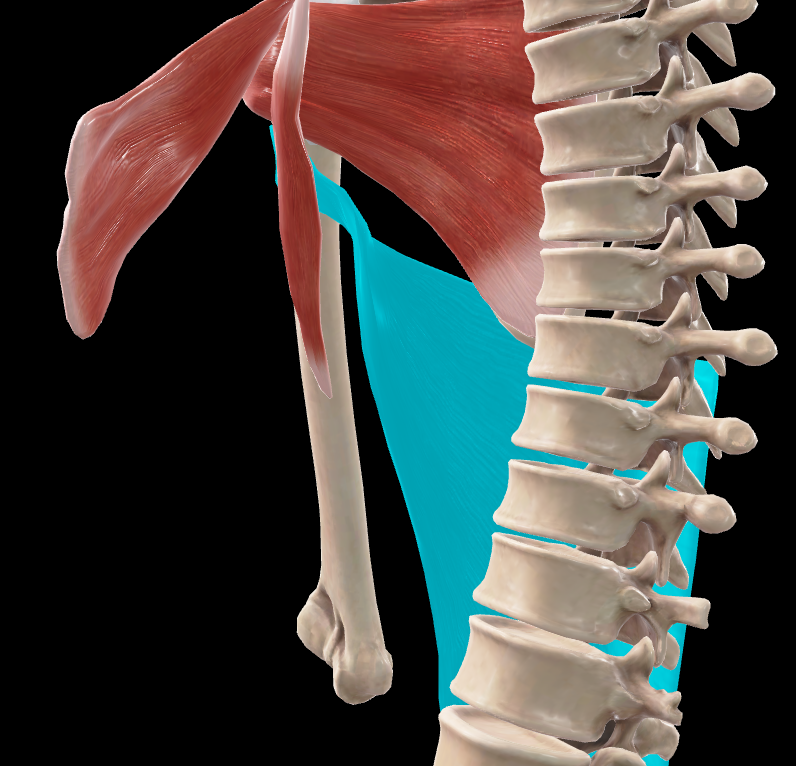
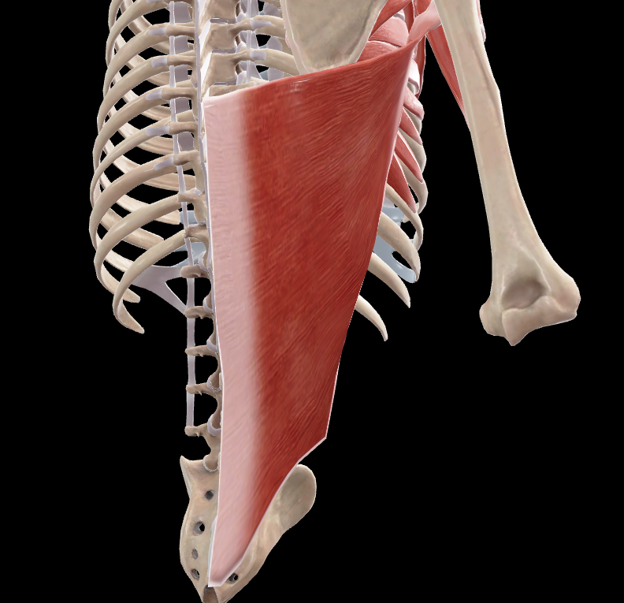
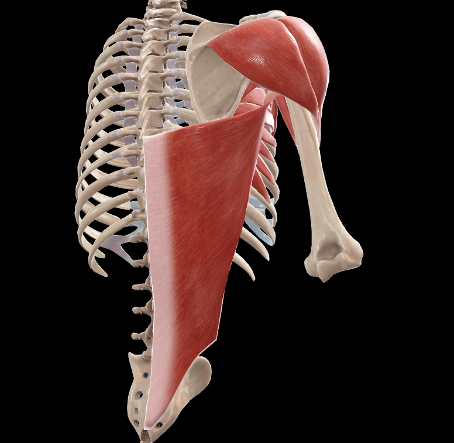

# Dorsal Ancho

> Músculo muy ancho, aplanado y delgado que cubre la parte posterior e inferior del tronco

#musculo #cintura-pectoral #espalda

## 📋 Datos Clave
- **Grupo:** Músculos extrínsecos de la espalda
- **Función principal:** Aductor, extensor y rotador medial del brazo
- **Inervación:** [[Nervio toracodorsal]] (C6-C8)

## 📷 Imágenes de Referencia

*Inserciones del músculo*

*Inserciones seleccionadas*

*Vista medial del músculo*

*Vista posterior del músculo*

*Vista tapada del músculo*

## Origen
1. **Fascia toracolumbar:** Lámina tendinosa triangular que se inserta en:
   - Apófisis espinosas y ligamentos supraespinosos de las seis últimas vértebras torácicas
   - Apófisis espinosas y ligamentos supraespinosos de las cinco vértebras lumbares
   - Cresta sacra media
   - Tercio posterior de la cresta ilíaca
2. **Cara externa de las cuatro últimas costillas:** Por medio de cuatro lengüetas carnosas que encajan con las digitaciones del músculo oblicuo externo del abdomen
3. **Ángulo inferior de la escápula:** A veces se origina un fascículo accesorio

## Inserción
- **Fondo del surco intertubercular** del húmero
- Por medio de un tendón aplanado
- Anterior al músculo redondo mayor, del que está separado por una bolsa sinovial
- Posterior y medial al tendón del músculo pectoral mayor

## Relaciones
- Cubre el ángulo inferior de la escápula
- Rodea el borde inferior del músculo redondo mayor y pasa anterior a él
- Queda inferior al músculo subescapular
- Forma la pared posterior de la fosa axilar con el músculo redondo mayor
- Experimenta una torsión que hace que su borde inferior se convierta en superior
- Un arco fibroso corto y grueso une su tendón a la cabeza larga del músculo tríceps braquial

## Vascularización
- Arteria toracodorsal (rama de la arteria subescapular)
- Arterias intercostales
- Arterias lumbares

## Inervación
- Nervio toracodorsal (C6-C8)
- Rama del fascículo posterior del plexo braquial

## Funciones
**Con punto fijo en el tronco:**
1. **Aducción del brazo:** Aproxima el brazo al tronco
2. **Extensión del brazo:** Lleva el brazo desde la flexión a la posición anatómica
3. **Rotación medial del brazo:** Gira el brazo hacia adentro
4. **Depresión del hombro:** Baja el hombro

**Con punto fijo en el húmero:**
1. **Elevación del tronco:** Como en trepar o hacer dominadas
2. **Inspiración forzada:** Eleva las costillas inferiores
3. **Extensión del tronco:** Desde la flexión anterior

## Características especiales
- Es el músculo más ancho del cuerpo humano
- Su tendón da origen a un fascículo tensor de la fascia del brazo
- Forma parte del triángulo lumbar (de Petit) junto con el oblicuo externo del abdomen y la cresta ilíaca
- Participa en movimientos potentes como trepar, remar y hacer dominadas
- Su potencia es de aproximadamente 4-5 kg

## 🔗 Fuente
- Rouvier-Anatomía Humana, Tomo 3

## 🔗 Enlaces
- [[Fascia del dorsal ancho]]
- [[Nervio toracodorsal]]