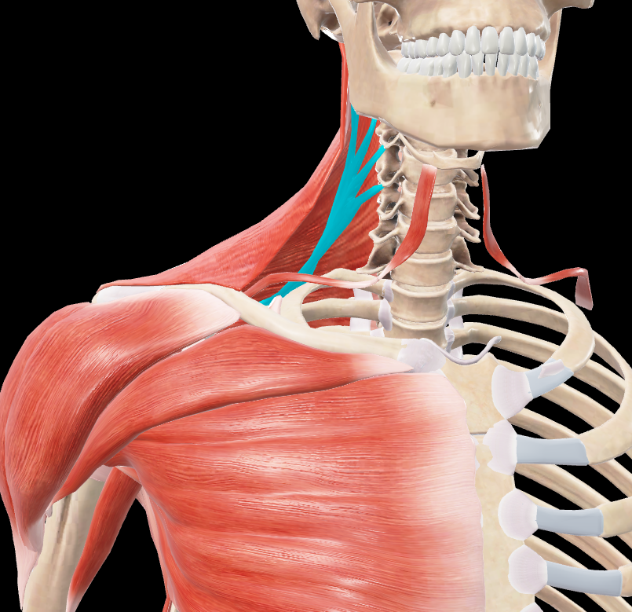
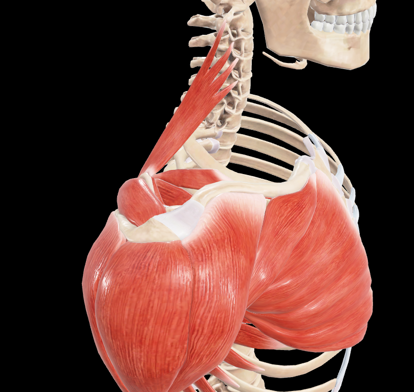
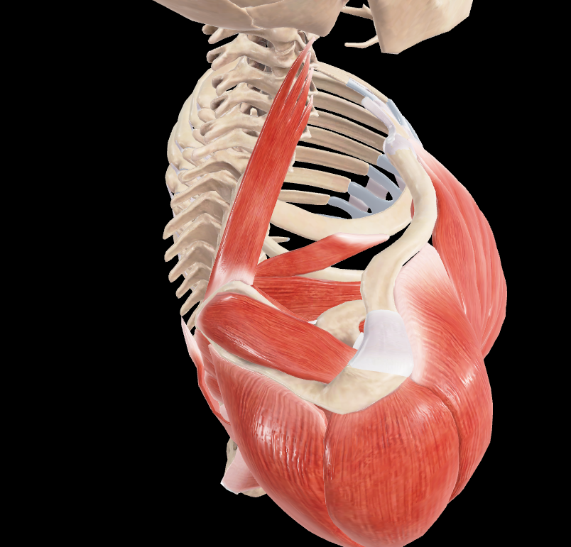
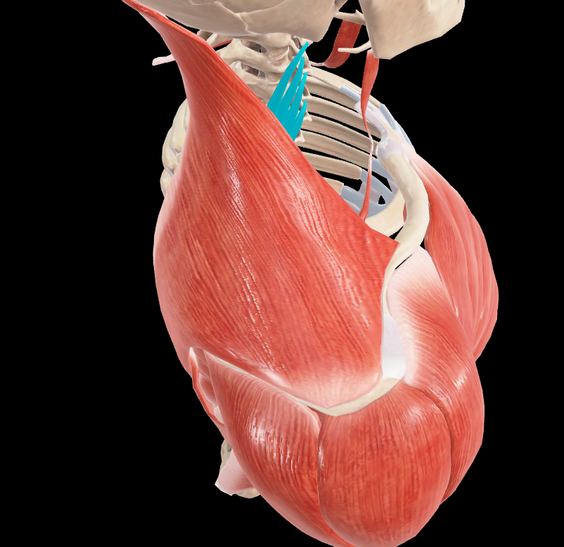
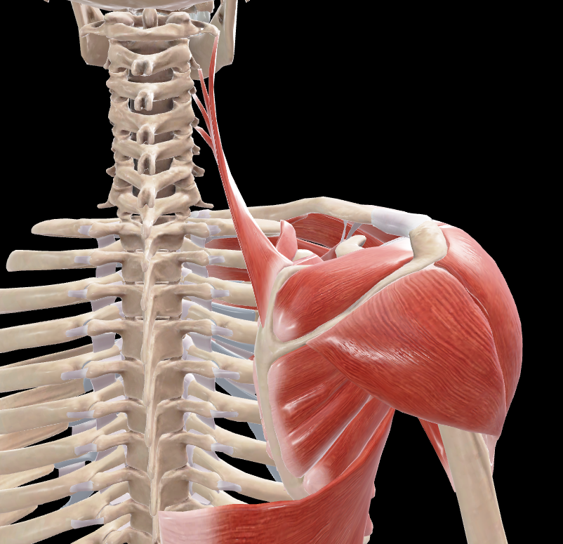

# Elevador de la Escápula

> Músculo alargado y delgado situado en la parte posterior y lateral del cuello

#musculo #cintura-pectoral #escapula

## 📋 Datos Clave
- **Grupo:** Músculos profundos de la espalda
- **Función principal:** Elevación y rotación de la escápula
- **Inervación:** [[Nervio dorsal de la escápula]] (C3-C5) y [[Nervio cervical]] (C3-C4)

## 📷 Imágenes de Referencia

*Vista anterior seleccionada*

*Vista lateral del músculo*

*Vista lateral superior*

*Vista lateral superior tapada y seleccionada*

*Vista posterior del músculo*

## Origen
[por completar - según Rouvier]

## Inserción
[por completar - según Rouvier]

## Relaciones
- Situado profundamente al músculo esternocleidomastoideo
- Lateral a los músculos escalenos
- Superior al músculo romboides menor
- Forma parte de la capa profunda de los músculos del cuello

## Vascularización
- Arteria cervical transversa
- Arteria dorsal de la escápula
- Arterias intercostales

## Inervación
- Nervio dorsal de la escápula (C4-C5)
- Ramos de los nervios cervicales C3-C4

## Funciones
**Con punto fijo en la columna vertebral:**
1. **Elevación de la escápula:** Eleva el hombro
2. **Rotación de la escápula:** Gira la escápula para deprimir el hombro
3. **Inclinación lateral de la escápula:** Inclina la escápula hacia el lado contraído

**Con punto fijo en la escápula:**
1. **Inclinación lateral de la cabeza:** Inclina la cabeza hacia el mismo lado
2. **Rotación de la cabeza:** Gira la cara hacia el lado opuesto
3. **Extensión de la cabeza:** Desde la flexión anterior

## Características especiales
- También conocido como "angular de la escápula"
- Forma parte del triángulo posterior del cuello
- Participa en movimientos de encogimiento de hombros
- Trabaja en sinergia con el trapecio superior
- Puede causar dolor cervical y cefalea tensional cuando está contracturado

## 🔗 Fuente
- Rouvier-Anatomía Humana, Tomo 3