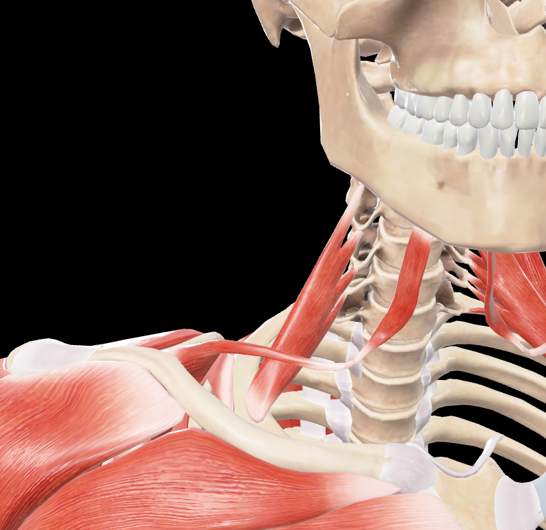
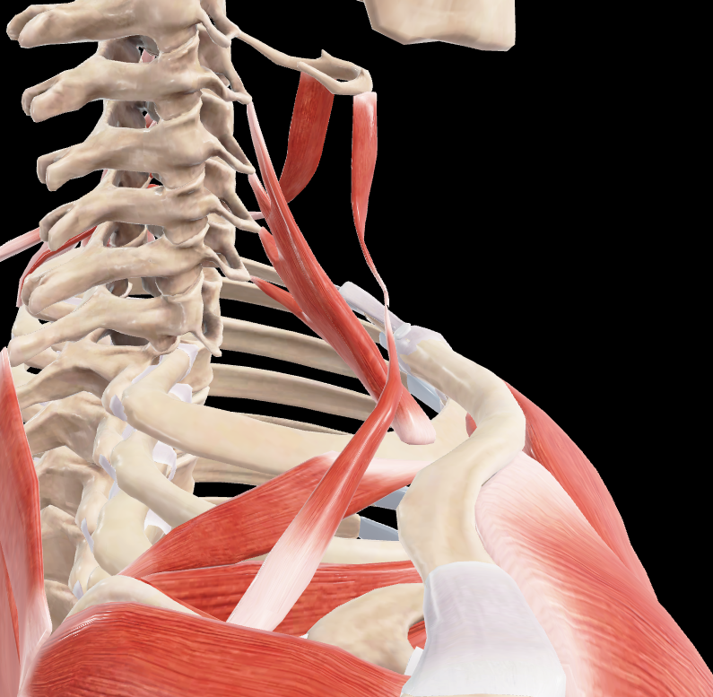

# Escaleno Anterior

> Músculo profundo del cuello, el más anterior de los músculos escalenos

#musculo #cintura-pectoral

## 📋 Datos Clave
- **Grupo:** Músculos escalenos
- **Función principal:** Flexión lateral del cuello y elevación de la primera costilla
- **Inervación:** Ramos anteriores de C4-C6

## 📷 Imágenes de Referencia

*Vista anterior del escaleno anterior*

*Vista lateral-posterior del escaleno anterior*

## Origen
- Apófisis transversas de C3-C6

## Inserción
- Tubérculo escaleno de la primera costilla

## Relaciones
- Anterior a [[Escaleno Medio]]
- Forma el triángulo interescaleno con [[Escaleno Medio]]
- La [[Arteria subclavia]] y [[Plexo braquial]] pasan entre escaleno anterior y medio

## Vascularización
- [[Arteria cervical ascendente]]
- [[Arteria tiroidea inferior]]

## Inervación
- Ramos anteriores de los nervios cervicales C4-C6

## Funciones
- Flexión lateral del cuello (unilateral)
- Rotación contralateral del cuello (unilateral)
- Flexión del cuello (bilateral)
- Elevación de la primera costilla (inspiración accesoria)
- Estabilización del cuello durante los movimientos

## 🔗 Fuente
- Rouvier-Anatomía Humana, Tomo 3