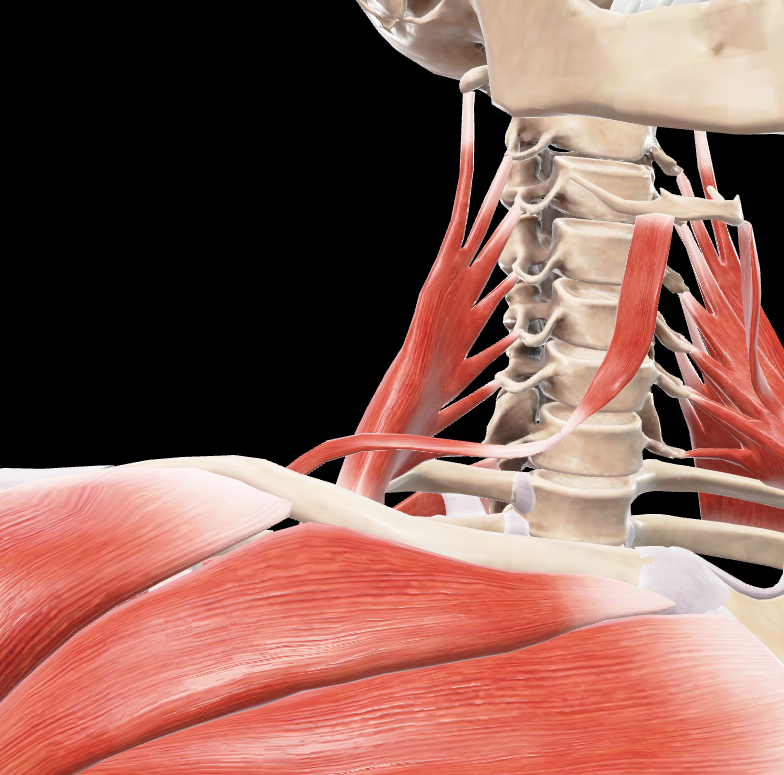
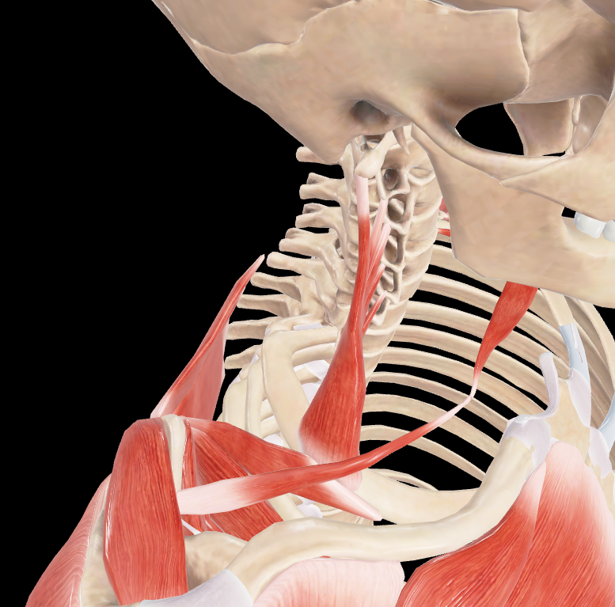

# Escaleno Medio

> Músculo profundo del cuello, situado entre el escaleno anterior y posterior

#musculo #cintura-pectoral

## 📋 Datos Clave
- **Grupo:** Músculos escalenos
- **Función principal:** Flexión lateral del cuello y elevación de la primera costilla
- **Inervación:** Ramos anteriores de C3-C8

## 📷 Imágenes de Referencia

*Vista anterior del escaleno medio*

*Vista superior del escaleno medio*

## Origen
- Apófisis transversas de C2-C7

## Inserción
- Primera costilla (posterior al surco de la arteria subclavia)

## Relaciones
- Entre [[Escaleno Anterior]] y [[Escaleno Posterior]]
- Forma el triángulo interescaleno con [[Escaleno Anterior]]
- La [[Arteria subclavia]] pasa entre escaleno anterior y medio

## Vascularización
- [[Arteria cervical ascendente]]
- [[Arteria vertebral]]

## Inervación
- Ramos anteriores de los nervios cervicales C3-C8

## Funciones
- Flexión lateral del cuello (unilateral)
- Rotación contralateral del cuello (unilateral)
- Flexión del cuello (bilateral)
- Elevación de la primera costilla (inspiración accesoria)
- Estabilización del cuello durante los movimientos

## 🔗 Fuente
- Rouvier-Anatomía Humana, Tomo 3