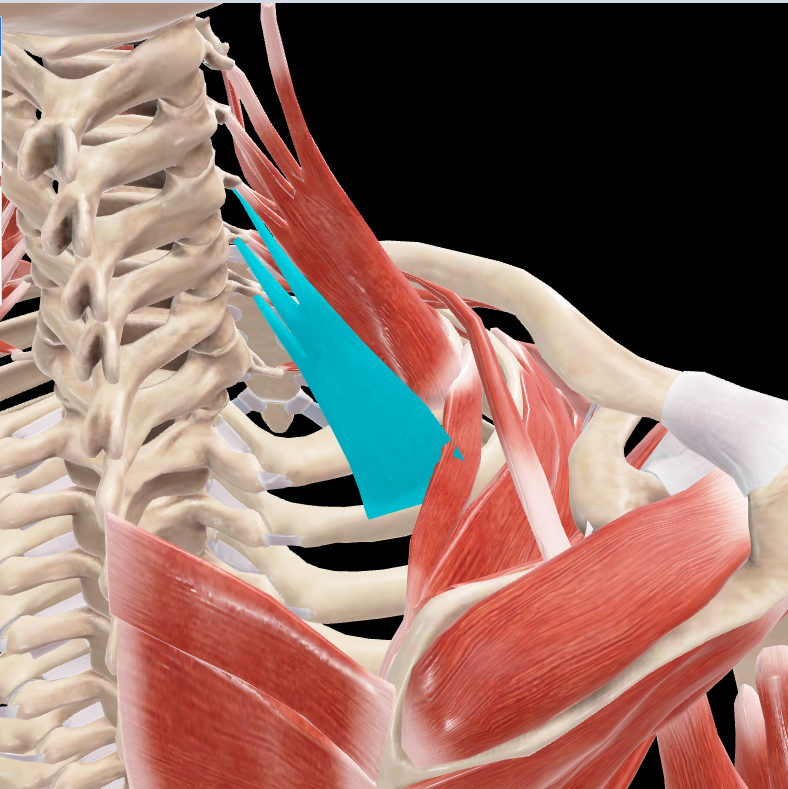

# Escaleno Posterior

> Músculo profundo del cuello, el más posterior de los músculos escalenos

#musculo #cintura-pectoral

## 📋 Datos Clave
- **Grupo:** Músculos escalenos
- **Función principal:** Flexión lateral del cuello y elevación de la segunda costilla
- **Inervación:** Ramos anteriores de C6-C8

## 📷 Imágenes de Referencia

*Vista posterior seleccionada del escaleno posterior*

## Origen
- Apófisis transversas de C5-C7

## Inserción
- Segunda costilla

## Relaciones
- Posterior a [[Escaleno Medio]]
- Relacionado con [[Elevador de la Escápula]] y [[Serrato Posterior Superior]]
- Forma parte del plano profundo de los músculos del cuello

## Vascularización
- [[Arteria cervical profunda]]
- [[Arteria intercostal superior]]

## Inervación
- Ramos anteriores de los nervios cervicales C6-C8

## Funciones
- Flexión lateral del cuello (unilateral)
- Rotación contralateral del cuello (unilateral)
- Flexión del cuello (bilateral)
- Elevación de la segunda costilla (inspiración accesoria)
- Estabilización del cuello durante los movimientos

## 🔗 Fuente
- Rouvier-Anatomía Humana, Tomo 3