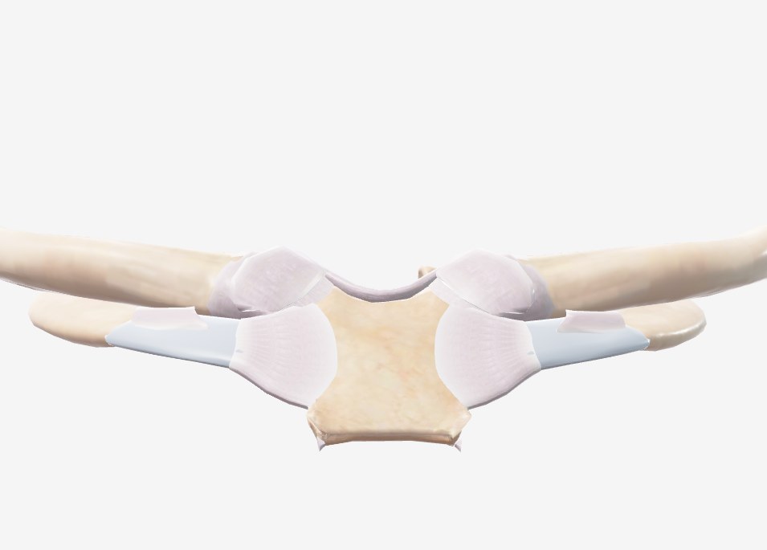
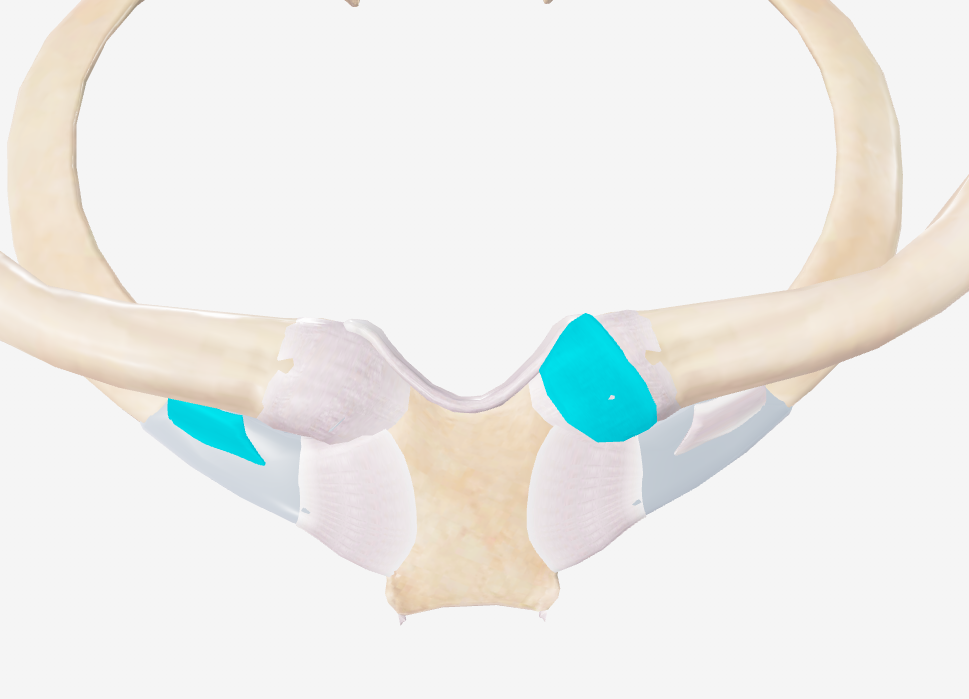
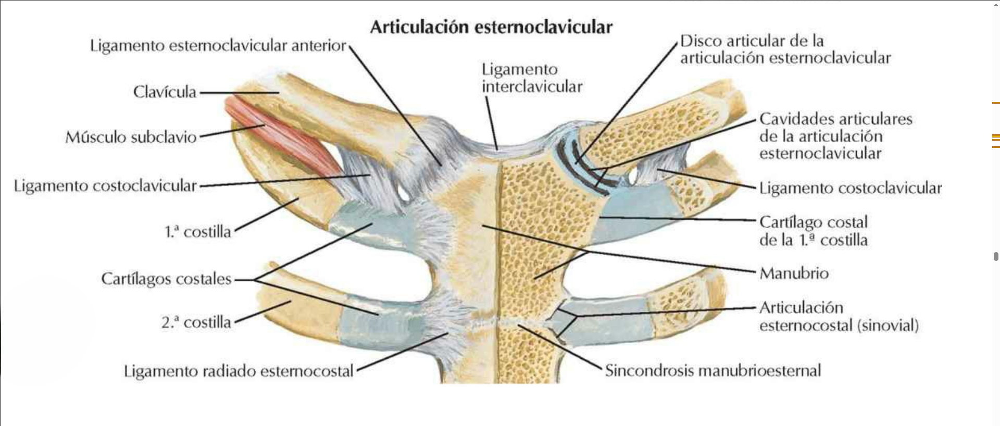
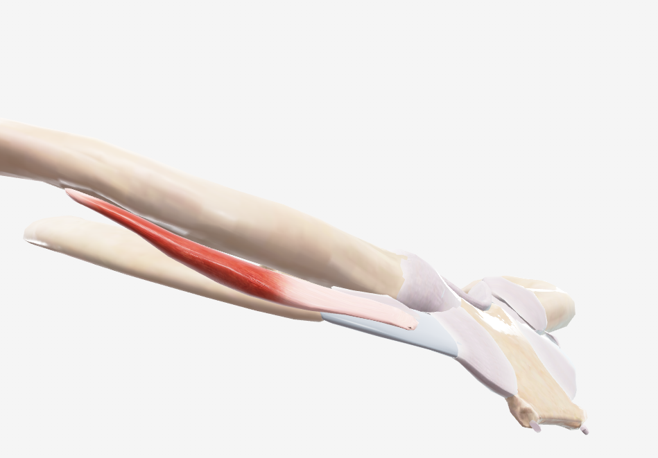

# Articulación Esternoclavicular

> Descripción breve: articulación sinovial que une la extremidad esternal de la clavícula con el manubrio del esternón y el primer cartílago costal. Única articulación que une el miembro superior al esqueleto axial.

## 📋 Datos Clave

- **Tipo:** sinovial, selar (encaje recíproco) o esferoidea
- **Clasificación:** diartrosis
- **Movimientos:** elevación/descenso, protracción/retracción, rotación
- **Estabilidad:** alta (múltiples ligamentos)
- **Función:** unir cintura escapular al esqueleto axial, permitir movimientos de la clavícula

#articulacion #hombro #cintura-pectoral

---

## 📷 Imágenes de Referencia

*Vista anterior de la articulación esternoclavicular*

*Vista superior de la articulación esternoclavicular*

---

## Anatomía Descriptiva

### Superficies Articulares

#### Extremidad Esternal de la Clavícula
- Cara articular elíptica o irregular
- Convexa en sentido anteroposterior
- Cóncava en sentido vertical
- Revestida de fibrocartílago

#### Manubrio del Esternón
- Escotadura clavicular
- Cara articular para clavícula
- También articula con primer cartílago costal

#### Primer Cartílago Costal
- Contribuye a la superficie articular
- Forma ángulo diedro con el esternón

### Disco Articular
- **Fibrocartilaginoso**, completo (divide articulación en 2 cavidades)
- **Forma:** irregular, más grueso periféricamente
- **Función:** aumentar congruencia, absorber fuerzas, permitir movimientos complejos
- **Inserción:**
  - Superior: extremidad esternal de clavícula
  - Inferior: primer cartílago costal y manubrio
  - Anterior/posterior: cápsula articular

---

## Medios de Unión

### Cápsula Articular
- **Fuerte pero laxa**
- Se inserta en bordes de superficies articulares
- Reforzada por ligamentos

### Ligamento Esternoclavicular Anterior
- Desde borde anterior de extremidad clavicular hasta borde anterior del manubrio
- Refuerza cápsula anteriormente
- Limita retracción clavicular

### Ligamento Esternoclavicular Posterior
- Más fuerte que el anterior
- Desde borde posterior de extremidad clavicular hasta borde posterior del manubrio
- Refuerza cápsula posteriormente
- Limita protracción clavicular

### Ligamento Interclavicular
- Conecta extremidades esternales de ambas clavículas
- Se inserta en escotadura yugular del esternón
- Limita depresión clavicular (evita hundimiento de hombros)

### Ligamento Costoclavicular (Ligamento Romboidal)
- **Principal estabilizador**
- Desde cara inferior de clavícula (impresión costoclavicular) hasta primera costilla y su cartílago
- **Dos fascículos:** anterior (limita elevación) y posterior (limita depresión)
- Actúa como fulcro para movimientos claviculares

---

## Vascularización

| Arteria | Territorio |
|---------|-----------|
| [[Arteria torácica interna]] | ramas esternales |
| [[Arteria supraescapular]] | ramas claviculares |
| [[Arteria toracoacromial]] | ramas claviculares |

---

## Inervación

| Nervio | Función |
|--------|---------|
| Ramos del [[Nervio supraclavicular]] (C3-C4) | inervación cutánea |
| Ramos del [[Plexo braquial]] | inervación profunda |
| Ramos del [[Nervio frénico]] (C3-C5) | posible contribución |

---

## Movimientos y Ejes

### Elevación/Descenso (40-60°)
- **Eje:** anteroposterior
- **Elevación:** [[Trapecio]] (superior), [[Esternocleidomastoideo]]
- **Descenso:** [[Pectoral menor]], [[Subclavio]], gravedad
- **Limitado por:** ligamento costoclavicular

### Protracción/Retracción (30-35°)
- **Eje:** vertical
- **Protracción:** [[Serrato anterior]], [[Pectoral menor]]
- **Retracción:** [[Romboides]], [[Trapecio]] (medio)
- **Limitado por:** ligamentos esternoclaviculares

### Rotación Axial (40-50°)
- **Eje:** longitudinal de la clavícula
- **Rotación posterior:** durante elevación del brazo >90°
- **Rotación anterior:** durante descenso
- **Importante para:** ritmo escapulohumeral completo

### Movimientos Combinados
- **Circunducción clavicular**
- **Acompañamiento** de movimientos escapulares
- **Transmisión** de fuerzas desde miembro superior a esqueleto axial

---

## Biomecánica

### Estabilidad
- **Alta estabilidad** a pesar de poca congruencia ósea
- **Sistema ligamentoso complejo** (especialmente costoclavicular)
- **Disco articular** como amortiguador
- **Músculos periarticulares**

### Transmisión de Fuerzas
- **Del miembro superior al esqueleto axial**
- **Amortiguación** por disco articular y ligamentos
- **Distribución** entre esternón y primera costilla

### Cinemática
- **Movimientos tridimensionales complejos**
- **Coordinación** con articulación acromioclavicular
- **Contribución** a movimientos globales del hombro

---

## Relaciones Anatómicas

### Anteriores
- **Piel** y **tejido celular subcutáneo**
- [[Platisma]]
- [[Músculo esternocleidomastoideo]] (cabeza esternal)
- [[Vena yugular anterior]]

### Posteriores
- **Manubrio del esternón**
- **Arterias** y **venas** innominadas (braquiocefálicas)
- [[Tráquea]]
- [[Esófago]] (ligeramente a izquierda)
- [[Nervio vago]]
- [[Conducto torácico]] (izquierda)
- **Pleura** y **ápice pulmonar**

### Superiores
- [[Ligamento interclavicular]]
- **Espacio supraesternal** (de Burns)

### Inferiores
- **Primera costilla** y **cartílago costal**
- [[Músculo subclavio]]
- [[Vena subclavia]]

### Laterales
- [[Clavícula]]
- [[Músculo pectoral mayor]] (porción clavicular)

---

## Variaciones Anatómicas

### Superficies Articulares
- **Tamaño** y **forma** variables
- **Grado de congruencia** diferente
- **Participación** del primer cartílago costal variable

### Disco Articular
- **Espesor** variable
- **Completitud** (ocasionalmente incompleto)
- **Comunicación** entre cavidades articulares

### Ligamentos
- **Desarrollo** variable del ligamento costoclavicular
- **Presencia** de ligamentos accesorios

---

## Notas Clínicas

### Luxación Esternoclavicular
- **Rara** (<1% de luxaciones)
- **Mecanismo:** trauma directo (posterior) o indirecto (anterior)
- **Dirección:** anterior (más común, menos grave) o posterior (menos común, más grave)
- **Complicaciones posteriores:** compresión mediastínica (tráquea, esófago, vasos)
- **Tratamiento:** reducción cerrada (posterior) o abierta si complicada

### Artrosis Esternoclavicular
- **Común** con edad (>60 años)
- **Síntomas:** dolor localizado, crepitación, tumefacción
- **Diagnóstico:** radiografía, TC
- **Tratamiento:** conservador (AINES, infiltraciones), raramente quirúrgico

### Síndrome de Tietze
- **Inflamación** idiopática de articulación esternocostal (primera)
- **Confusión** posible con patología esternoclavicular
- **Característica:** tumefacción dolorosa, autolimitada

### Hiperlaxitud
- **Laxitud ligamentosa** congénita o adquirida
- **Subluxación** dolorosa con movimientos
- **Tratamiento:** fortalecimiento muscular, evitar movimientos extremos

### Fracturas Adyacentes
- **Fractura de clavícula medial:** puede simular luxación
- **Fractura de esternón:** trauma de alta energía
- **Diferenciación** crucial para tratamiento

---

## Tabla de Imágenes

| Imagen | Vista | Descripción |
|--------|-------|-------------|
|  | Anterior | Vista anterior de la articulación esternoclavicular |
|  | Superior | Vista superior de la articulación esternoclavicular |
|  | Corte anterior | Corte anterior de la articulación esternoclavicular |
|  | Músculo subclavio | Relación con el músculo subclavio |

---

## 🔗 Fuente
- Rouvier-Anatomía Humana, Tomo 3