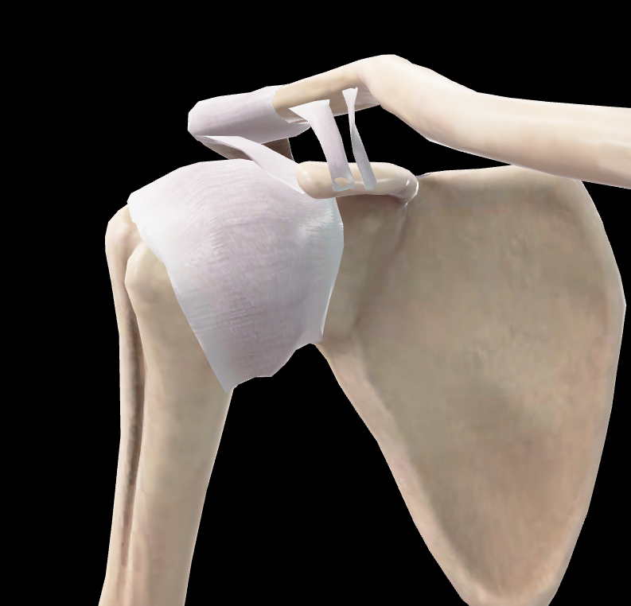
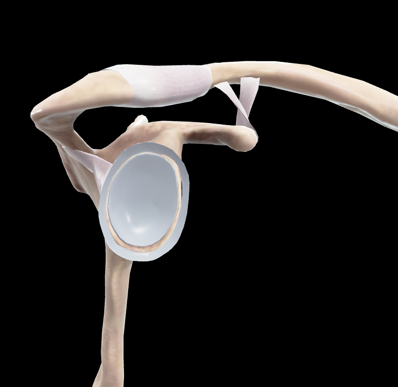
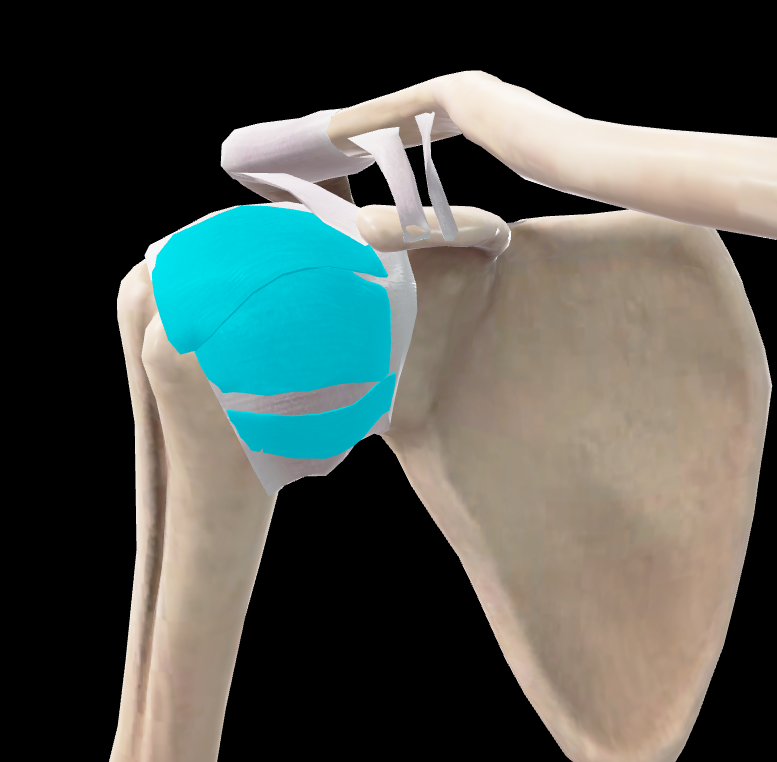
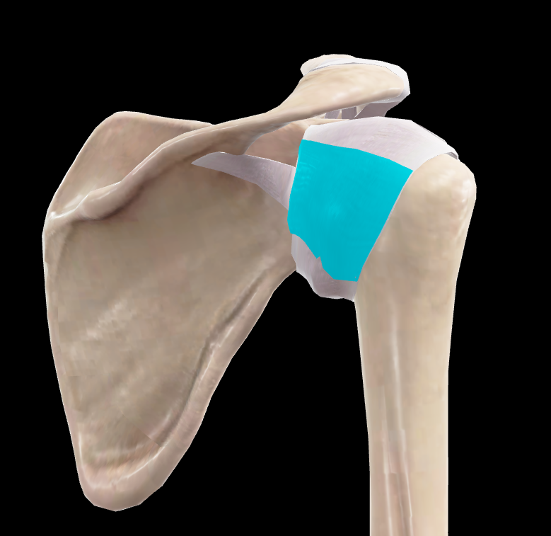

# Articulación Glenohumeral

> Descripción breve: articulación esferoidea que une el húmero a la escápula. También conocida como articulación del hombro. Es la articulación más móvil del cuerpo humano. (Rouvier)

## 📋 Datos Clave

- **Tipo:** sinovial, esferoidea (enartrosis)
- **Clasificación:** diartrosis
- **Movimientos:** flexión, extensión, abducción, aducción, rotación medial y lateral, circunducción
- **Estabilidad:** baja (depende de músculos y ligamentos)
- **Función:** máxima movilidad del miembro superior

#articulacion #hombro #cintura-pectoral

---

## 📷 Imágenes de Referencia

*Vista anterior de la articulación glenohumeral*

*Cavidad glenoidea vista lateral*

---

## Anatomía Descriptiva (Rouvier)

### Superficies Articulares

#### Cabeza del Húmero
- Representa la **tercera parte de una esfera** de 30 mm de radio
- Ligeramente más extensa en sentido **vertical** que anteroposterior
- Revestida por capa uniforme de cartílago de ~2 mm de espesor
- Limitada por el labio medial del cuello anatómico
- **Fosita supratubercular:** escotadura angular/medialuna superior al tubérculo menor, para ligamento glenohumeral superior
- **Orientación** (posición anatómica): medial, superior y posterior
- **Ángulo con el cuerpo del húmero:** ~130°

#### Cavidad Glenoidea de la Escápula
- Mucho **menos extensa** que la cabeza del húmero
- **Orientación inversa** a la cabeza humeral
- Forma **oval** con extremo ancho inferior
- Irregularmente excavada en hueso seco
- **Tubérculo glenoideo:** eminencia central
- **Concavidad más pronunciada** en parte inferior
- Cartílago en estado fresco regulariza la concavidad
- **Espesor cartilaginoso desigual:** más grueso en mitad inferior, muy delgado a nivel del tubérculo

### Labrum Glenoidal
- Rodete fibrocartilaginoso que profundiza la cavidad glenoidea
- Aumenta la congruencia articular
- Proporciona inserción a la cápsula articular y ligamentos glenohumerales

---

## Medios de Unión (Rouvier)

### Cápsula Articular
- **Manguito fibroso laxo y amplio**
- Se inserta:
  - **Escápula:** alrededor del labrum glenoidal
  - **Húmero:** cuello anatómico (excepto medialmente donde desciende más)
- **Recesos sinoviales:** permiten distensión en movimientos extremos
- Más laxa inferiormente (zona de debilidad)

### Ligamentos Glenohumerales
1. **Ligamento Glenohumeral Superior**
   - Desde borde superior de la cavidad glenoidea hasta fosita supratubercular
   - Refuerza cápsula superiormente

2. **Ligamento Glenohumeral Medio**
   - Desde borde anterior de la cavidad glenoidea hasta cuello anatómico
   - Limita la rotación lateral y traslación anterior

3. **Ligamento Glenohumeral Inferior**
   - En forma de hamaca (complejo ligamentoso)
   - Desde borde anterior-inferior de la cavidad glenoidea hasta cuello anatómico
   - Principal estabilizador anterior-inferior

### Ligamento Coracohumeral
- Desde apófisis coracoides hasta tubérculo mayor
- Refuerza cápsula superiormente
- Limita la traslación inferior del húmero

### Ligamento Coracoacromial
- Forma el **arco coracoacromial** con acromion y apófisis coracoides
- Limita la elevación superior del brazo
- Protege estructuras subyacentes

---

## Bolsas Sinoviales

### Bolsa Subacromial/Subdeltoidea
- Entre arco coracoacromial y manguito rotador
- Reduce fricción durante elevación del brazo
- Comunicada con articulación en 10% de casos

### Bolsa Subcoracoidea
- Entre apófisis coracoides y cápsula articular
- A veces comunicada con cavidad articular

### Otras Bolsas
- **Bolsa del subescapular:** entre tendón subescapular y cuello de la escápula
- **Bolsa infraspinosa:** entre tendón infraespinoso y cápsula

---

## Vascularización

| Arteria | Territorio |
|---------|-----------|
| [[Arteria circunfleja humeral anterior]] | porción anterior |
| [[Arteria circunfleja humeral posterior]] | porción posterior |
| [[Arteria supraescapular]] | porción superior |
| [[Arteria subescapular]] | porción anterior-inferior |
| [[Arteria toracoacromial]] | porción superior-anterior |

---

## Inervación

| Nervio | Función |
|--------|---------|
| [[Nervio axilar]] (C5-C6) | inervación principal |
| [[Nervio supraescapular]] (C5-C6) | porción superior |
| Ramos del [[Plexo braquial]] | contribución |

---

## Movimientos y Músculos

### Flexión (0-180°)
- **Músculos principales:** [[Deltoides]] (porción anterior), [[Pectoral Mayor]] (porción clavicular), [[Coracobraquial]]
- **Amplitud:** 180°
- **Eje:** transversal

### Extensión (0-60°)
- **Músculos principales:** [[Deltoides]] (porción posterior), [[Redondo Mayor]], [[Dorsal Ancho]]
- **Amplitud:** 60°
- **Eje:** transversal

### Abducción (0-180°)
- **0-90°:** [[Supraespinoso]], [[Deltoides]]
- **>90°:** rotación escapular ([[Trapecio]], [[Serrato Anterior]])
- **Amplitud:** 180°
- **Eje:** anteroposterior

### Aducción (0°)
- **Músculos principales:** [[Pectoral Mayor]], [[Dorsal Ancho]], [[Redondo Mayor]]
- **Amplitud:** desde abducción hasta línea media
- **Eje:** anteroposterior

### Rotación Medial (0-70°)
- **Músculos principales:** [[Subescapular]], [[Pectoral Mayor]], [[Dorsal Ancho]], [[Redondo Mayor]]
- **Amplitud:** 70°
- **Eje:** vertical

### Rotación Lateral (0-90°)
- **Músculos principales:** [[Infraespinoso]], [[Redondo Menor]]
- **Amplitud:** 90°
- **Eje:** vertical

### Circunducción
- **Combinación** de todos los movimientos anteriores
- **Trayectoria** cónica

---

## Biomecánica

### Estabilidad Articular
- **Baja estabilidad ósea** (cavidad glenoidea pequeña)
- **Estabilidad dinámica:** manguito rotador ([[Supraespinoso]], [[Infraespinoso]], [[Redondo Menor]], [[Subescapular]])
- **Estabilidad estática:** cápsula, ligamentos, labrum
- **Presión negativa intraarticular** contribuye a la estabilidad

### Cinemática
- **Movimiento combinado** con articulación escapulotorácica
- **Ritmo escapulohumeral:** 2:1 (por cada 3° de abducción: 2° glenohumeral, 1° escapular)
- **Centro instantáneo de rotación:** dentro de la cabeza humeral

### Fuerzas Articulares
- **Fuerza de compresión:** manguito rotador centraliza cabeza humeral
- **Fuerzas de cizallamiento:** desestabilizadoras, contrarrestadas por ligamentos
- **Máxima carga:** en abducción 90° con rotación lateral

---

## Relaciones Anatómicas

### Superiores
- **Arco coracoacromial** (acromion + ligamento coracoacromial + apófisis coracoides)
- [[Bolsa subacromial]]
- [[Deltoides]]

### Anteriores
- [[Músculo subescapular]]
- [[Tendón de la cabeza larga del bíceps]]
- [[Proceso coracoides]]
- [[Plexo braquial]]
- [[Arteria axilar]]

### Posteriores
- [[Músculo infraespinoso]]
- [[Músculo redondo menor]]
- [[Nervio axilar]]

### Inferiores
- **Zona más débil** de la cápsula
- [[Nervio axilar]] (relación estrecha)
- [[Arteria circunfleja humeral posterior]]

### Mediales
- [[Escápula]]
- [[Músculo serrato anterior]]

---

## Variaciones Anatómicas

### Cavidad Glenoidea
- **Versión glenoidea:** ángulo de inclinación anteroposterior
- **Inclinación glenoidea:** ángulo de inclinación superior-inferior
- **Profundidad glenoidea:** variable

### Labrum
- **Variaciones de inserción**
- **Desgarros normales** (SLAP lesions variantes)
- **Foramen sublabral** (comunicación con receso subescapular)

### Ligamentos
- **Variaciones en grosor** y número de fascículos
- **Ligamento glenohumeral medio** ausente en 30% de casos

---

## Notas Clínicas

### Luxación Glenohumeral
- **Mecanismo:** abducción + rotación lateral + extensión
- **Dirección:** anterior (95%), posterior (2-4%), inferior (0.5%)
- **Lesión de Bankart:** desinserción anteroinferior del labrum
- **Lesión de Hill-Sachs:** impresión posterolateral de cabeza humeral

### Síndrome de Pinzamiento Subacromial
- **Causa:** compresión del manguito rotador bajo arco coracoacromial
- **Estadios:** I (edema/hemorragia), II (tendinosis/fibrosis), III (rotura)
- **Prueba de Neer:** dolor en elevación pasiva forzada
- **Prueba de Hawkins:** dolor en rotación medial con brazo en flexión 90°

### Artrosis Glenohumeral
- **Causa:** degeneración articular primaria o postraumática
- **Hallazgos:** estrechamiento articular, osteofitos, esclerosis
- **Tratamiento:** conservador → artroplastia

### Rotura del Manguito Rotador
- **Mecanismo:** degenerativo (edad) o traumático
- **Localización:** supraespinoso más frecuente
- **Signos:** dolor nocturno, debilidad en abducción, signo del brazo caído
- **Pruebas:** Jobe (supraespinoso), Patte (infraespinoso), lift-off (subescapular)

---

## Tabla de Imágenes

| Imagen | Vista | Descripción |
|--------|-------|-------------|
|  | Anterior | Vista anterior de la articulación glenohumeral |
|  | Cavidad glenoidea lateral | Cavidad glenoidea vista lateral |
|  | Ligamentos anteriores | Ligamentos anteriores de la articulación glenohumeral |
|  | Ligamento posterior | Ligamento posterior de la articulación glenohumeral |

---

## 🔗 Fuente
- Rouvier-Anatomía Humana, Tomo 3