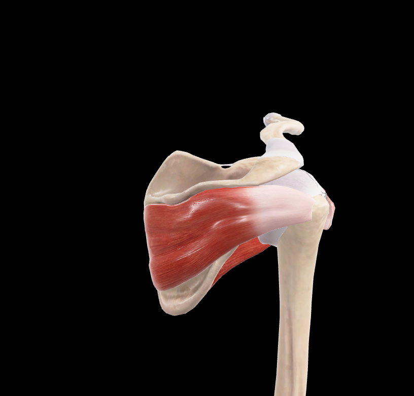

# Infraespinoso

> Músculo triangular que ocupa la mayor parte de la fosa infraespinosa

#musculo #cintura-pectoral #escapula #hombro

## 📋 Datos Clave
- **Grupo:** Músculos del manguito rotador
- **Función principal:** Rotación lateral del brazo
- **Inervación:** [[Nervio supraescapular]]

## 📷 Imágenes de Referencia

*Vista posterior del infraespinoso*

## Origen
- Fosa infraespinosa de la escápula
- Fascia infraespinosa

## Inserción
- Faceta media del tubérculo mayor del húmero
- Cápsula de la articulación glenohumeral

## Relaciones
- Ocupa la fosa infraespinosa
- Cubierto por [[Deltoides]] y [[Trapecio]]
- Superior a [[Redondo Menor]] y [[Redondo Mayor]]

## Vascularización
- [[Arteria supraescapular]]
- [[Arteria circunfleja escapular]]

## Inervación
- [[Nervio supraescapular]] (C5-C6)

## Funciones
- Rotación lateral del brazo
- Abducción del brazo (asistente)
- Estabilización de la articulación glenohumeral
- Previene la luxación anterior del húmero

## 🔗 Fuente
- Rouvier-Anatomía Humana, Tomo 3