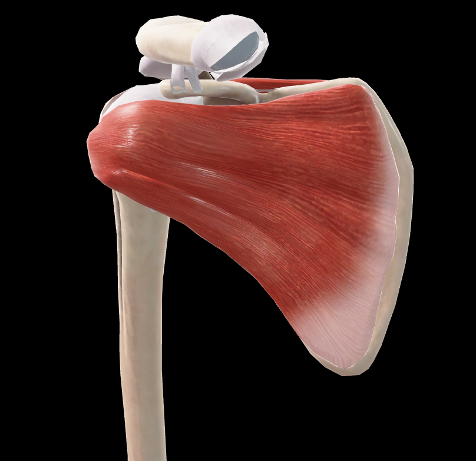

# Manguito Rotador Anterior

> Conjunto de músculos que estabilizan la articulación glenohumeral por su cara anterior

#musculo #cintura-pectoral #escapula #hombro

## 📋 Datos Clave
- **Grupo:** Músculos del manguito rotador
- **Función principal:** Rotación medial y estabilización del hombro
- **Inervación:** [[Nervio subescapular]]

## 📷 Imágenes de Referencia

*Vista anterior del manguito rotador*

## Componentes
- [[Subescapular]] (principal componente anterior)

## Origen
- Fosa subescapular de la escápula

## Inserción
- Tubérculo menor del húmero
- Cápsula articular glenohumeral

## Relaciones
- Entre la escápula y la cabeza humeral
- Forma la pared posterior de la axila
- Relacionado con [[Serrato Anterior]] y [[Pectoral Menor]]

## Vascularización
- [[Arteria subescapular]]
- [[Arteria circunfleja escapular]]

## Inervación
- [[Nervio subescapular superior]] e [[inferior]] (C5-C6)

## Funciones
- Rotación medial del brazo
- Aducción del brazo
- Estabilización anterior de la articulación glenohumeral
- Previene la luxación anterior del húmero
- Centra la cabeza humeral en la cavidad glenoidea

## 🔗 Fuente
- Rouvier-Anatomía Humana, Tomo 3