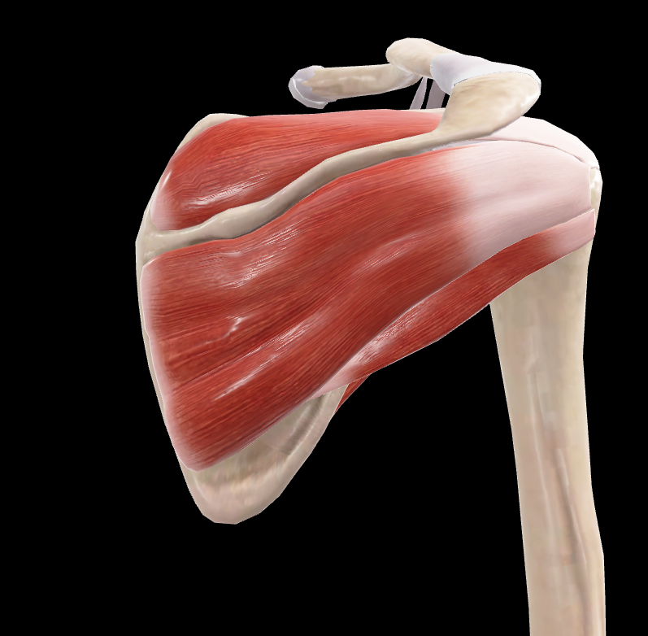

# Manguito Rotador Posterior

> Conjunto de músculos que estabilizan la articulación glenohumeral por su cara posterior

#musculo #cintura-pectoral #escapula #hombro

## 📋 Datos Clave
- **Grupo:** Músculos del manguito rotador
- **Función principal:** Rotación lateral y estabilización del hombro
- **Inervación:** [[Nervio supraescapular]] y [[Nervio axilar]]

## 📷 Imágenes de Referencia

*Vista posterior del manguito rotador*

## Componentes
- [[Supraespinoso]]
- [[Infraespinoso]]
- [[Redondo Menor]]

## Origen
- Fosas supraespinosa e infraespinosa de la escápula
- Borde lateral de la escápula

## Inserción
- Tubérculo mayor del húmero
- Cápsula articular glenohumeral

## Relaciones
- Cubiertos por [[Deltoides]] y [[Trapecio]]
- Entre la escápula y la cabeza humeral
- Relacionados con [[Redondo Mayor]] inferiormente

## Vascularización
- [[Arteria supraescapular]]
- [[Arteria circunfleja escapular]]

## Inervación
- [[Nervio supraescapular]] (C4-C6) - para supraespinoso e infraespinoso
- [[Nervio axilar]] (C5-C6) - para redondo menor

## Funciones
- Rotación lateral del brazo
- Abducción del brazo (supraespinoso)
- Estabilización posterior de la articulación glenohumeral
- Previene la luxación superior del húmero
- Centra la cabeza humeral en la cavidad glenoidea

## 🔗 Fuente
- Rouvier-Anatomía Humana, Tomo 3