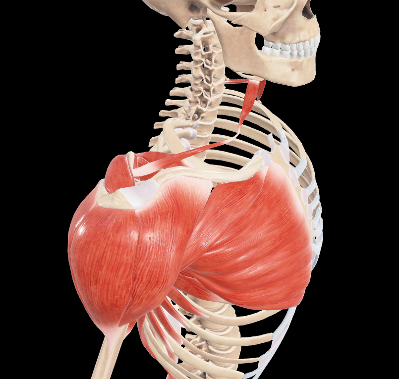
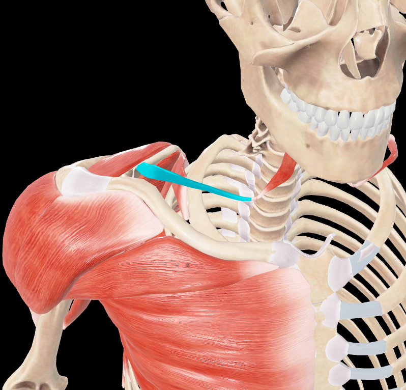
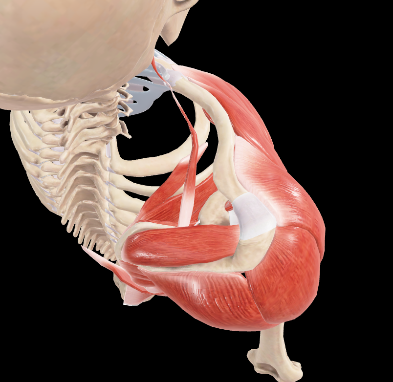

# Omohioideo

> Músculo digástrico (con dos vientres) que se extiende desde la escápula al hueso hioides

#musculo #cintura-pectoral

## 📋 Datos Clave
- **Grupo:** Músculos infrahioideos
- **Función principal:** Depresión del hueso hioides y la laringe
- **Inervación:** [[Asa cervical]] (C1-C3)

## 📷 Imágenes de Referencia

*Vista lateral del omohioideo*

*Omohioideo seleccionado*

*Vista superior del omohioideo*

## Origen
- Vientre inferior: borde superior de la escápula (cerca de la escotadura)
- Vientre superior: tendón intermedio

## Inserción
- Vientre superior: cuerpo del hueso hioides
- Vientre inferior: tendón intermedio

## Relaciones
- Forma parte del triángulo cervical posterior
- Relacionado con [[Esternocleidomastoideo]] anteriormente
- El tendón intermedio está fijado a la clavícula por una expansión fascial

## Vascularización
- [[Arteria tiroidea inferior]]
- [[Arteria cervical transversa]]

## Inervación
- [[Asa cervical]] (C1-C3)

## Funciones
- Depresión del hueso hioides
- Depresión de la laringe
- Tensión de la fascia cervical media
- Estabilización del hioides durante la deglución y el habla

## 🔗 Fuente
- Rouvier-Anatomía Humana, Tomo 3