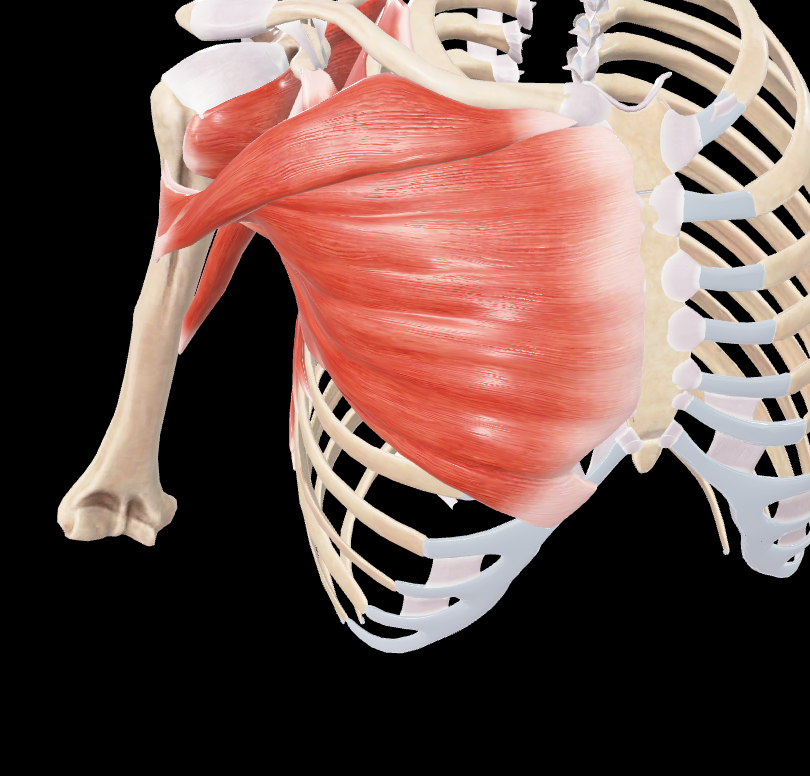
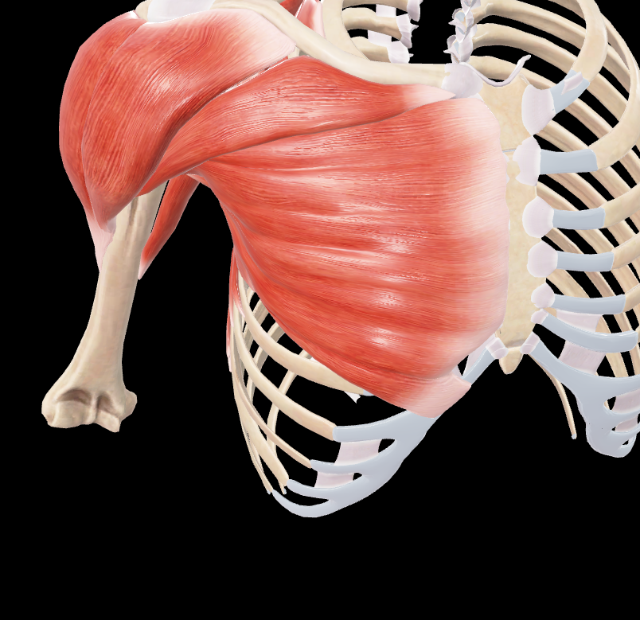

# Pectoral Mayor

> Músculo grande y superficial del tórax que forma la pared anterior de la axila

## 📋 Datos Clave
- **Grupo:** Músculos del tórax

#musculo #cintura-pectoral #hombro

- **Función principal:** Aducción, flexión y rotación medial del húmero
- **Inervación:** [[Nervio pectoral medial]] y [[Nervio pectoral lateral]]

#musculo #cintura-pectoral #hombro

## 📷 Imágenes de Referencia

*Inserciones del pectoral mayor*

*Pectoral mayor con estructuras adyacentes tapadas*

## Origen
- Porción clavicular: mitad medial de la clavícula
- Porción esternocostal: esternón, cartílagos costales 1-6
- Porción abdominal: vaina del recto abdominal

## Inserción
- Cresta del tubérculo mayor del húmero (labio lateral del surco intertubercular)

## Relaciones
- Superficial a [[Pectoral Menor]]
- Forma el límite anterior de la axila
- Relacionado con [[Deltoides]] en su inserción humeral

## Vascularización
- [[Arteria toracoacromial]]
- [[Arteria torácica lateral]]

## Inervación
- [[Nervio pectoral medial]] (C8-T1)
- [[Nervio pectoral lateral]] (C5-C7)

## Funciones
- Aducción del brazo
- Flexión del brazo (porción clavicular)
- Rotación medial del brazo
- Depresión del hombro
- Inspiración accesoria (cuando el brazo está fijo)

## 🔗 Fuente
- Rouvier-Anatomía Humana, Tomo 3

## 🔗 Enlaces
- [[Fascia pectoral]]
- [[Nervio pectoral lateral]]
- [[Nervio pectoral medial]]