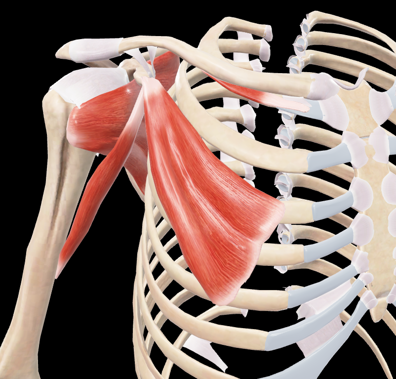

# Pectoral Menor

> Músculo delgado, aplanado y triangular situado profundamente al pectoral mayor

#musculo #cintura-pectoral #hombro

## 📋 Datos Clave
- **Grupo:** Músculos anteriores del hombro
- **Función principal:** Descender el muñón del hombro y elevar las costillas
- **Inervación:** [[Nervio pectoral medial]]

#musculo #cintura-pectoral #hombro

## 📷 Imágenes de Referencia

*Vista anterior y lateral del músculo*

## Origen
Se inserta mediante tres lengüetas tendinosas en:
- Cara externa de la tercera costilla
- Cara externa de la cuarta costilla
- Cara externa de la quinta costilla

## Inserción
En el borde medial y cara superior de la apófisis coracoides de la escápula.

## Relaciones
- Situado profundamente al músculo pectoral mayor
- Forma parte del plano clavipectoral
- Limita el espacio clavipectoral (triángulo de base medial)

## Vascularización
- Arteria toracoacromial
- Arterias torácicas superior y lateral
- Ramas perforantes de las arterias intercostales

## Inervación
- Nervio pectoral medial (C8-T1)

## Funciones
1. **Descenso del muñón del hombro:** Cuando toma su punto fijo en las costillas
2. **Elevación de las costillas:** Cuando toma su punto fijo en la escápula (inspirador)
3. **Estabilización de la escápula:** Mantiene la escápula aplicada contra el tórax
4. **Rotación de la escápula:** Participa en los movimientos de la cintura escapular

## 🔗 Fuente
- Rouvier-Anatomía Humana, Tomo 3

## 🔗 Enlaces
- [[Fascia clavipectoral]]
- [[Nervio pectoral medial]]