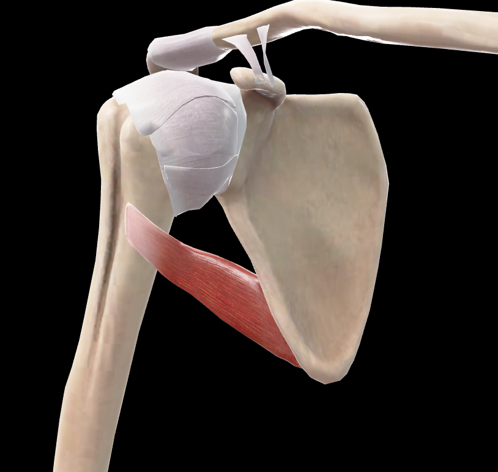
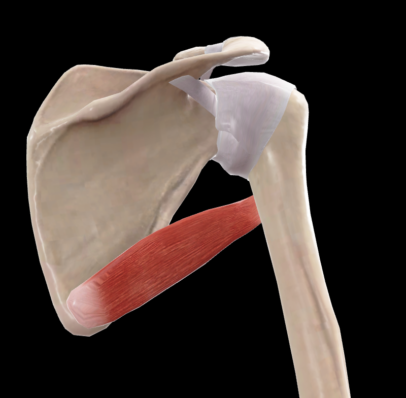

# Redondo Mayor

> Músculo grueso y aplanado en el borde lateral de la escápula

#musculo #cintura-pectoral #escapula #hombro

## 📋 Datos Clave
- **Grupo:** Músculos de la espalda
- **Función principal:** Aducción, extensión y rotación medial del brazo
- **Inervación:** [[Nervio subescapular inferior]]

## 📷 Imágenes de Referencia

*Vista anterior del redondo mayor*

*Vista posterior del redondo mayor*

## Origen
- Ángulo inferior de la escápula (cara dorsal)

## Inserción
- Cresta del tubérculo menor del húmero (labio medial del surco intertubercular)

## Relaciones
- Inferior a [[Redondo Menor]]
- Superior a [[Dorsal Ancho]] (con el que comparte inserción)
- Relacionado con [[Triceps Braquial]] (cabeza larga)

## Vascularización
- [[Arteria subescapular]]
- [[Arteria circunfleja escapular]]

## Inervación
- [[Nervio subescapular inferior]] (C5-C6)

## Funciones
- Aducción del brazo
- Extensión del brazo
- Rotación medial del brazo
- Estabilización de la articulación glenohumeral

## 🔗 Fuente
- Rouvier-Anatomía Humana, Tomo 3