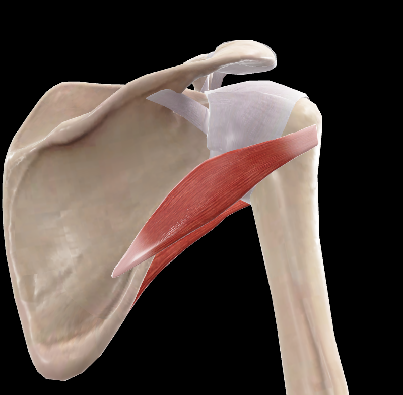

# Redondo Menor

> Músculo cilíndrico que se extiende desde el borde lateral de la escápula hasta el húmero

#musculo #cintura-pectoral #escapula #hombro

## 📋 Datos Clave
- **Grupo:** Músculos del manguito rotador
- **Función principal:** Rotación lateral del brazo
- **Inervación:** [[Nervio axilar]]

## 📷 Imágenes de Referencia

*Vista posterior del redondo menor*

## Origen
- Borde lateral de la escápula (cara dorsal)

## Inserción
- Faceta inferior del tubérculo mayor del húmero
- Cápsula de la articulación glenohumeral

## Relaciones
- Superior a [[Redondo Mayor]]
- Inferior a [[Infraespinoso]]
- Relacionado con [[Deltoides]] en su inserción

## Vascularización
- [[Arteria circunfleja escapular posterior]]
- [[Arteria subescapular]]

## Inervación
- [[Nervio axilar]] (C5-C6)

## Funciones
- Rotación lateral del brazo
- Aducción del brazo
- Extensión del brazo
- Estabilización de la articulación glenohumeral

## 🔗 Fuente
- Rouvier-Anatomía Humana, Tomo 3