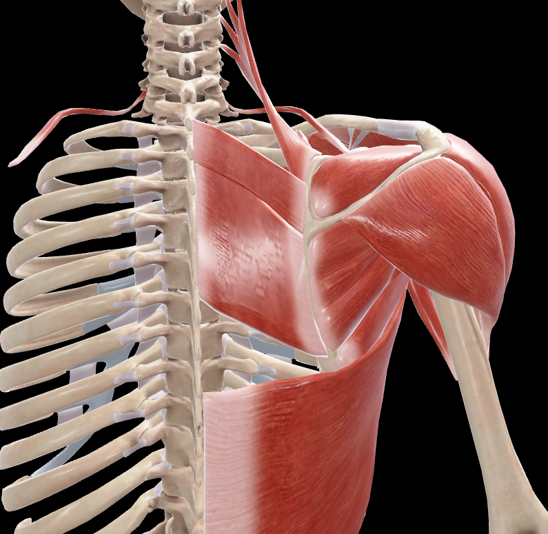
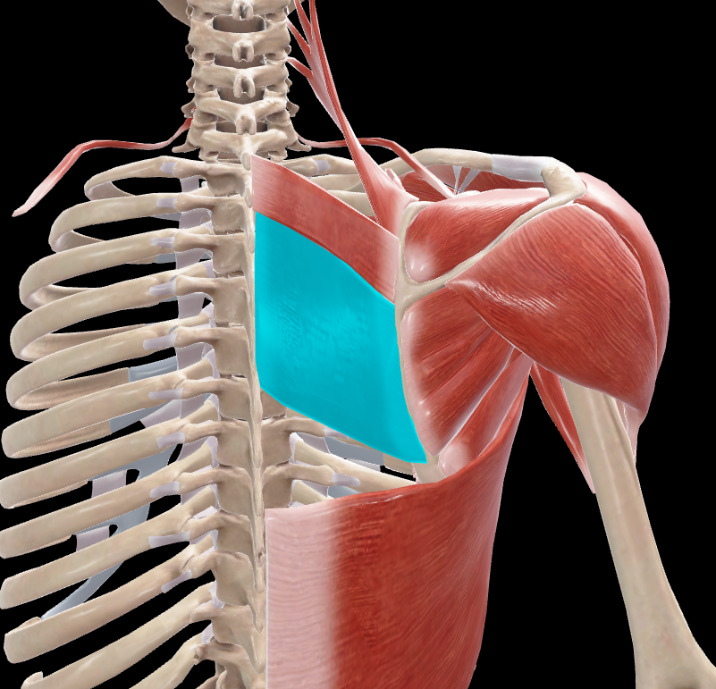

# Romboides Mayor

> Músculo aplanado y cuadrilátero situado profundamente al trapecio

#musculo #cintura-pectoral #escapula

## 📋 Datos Clave
- **Grupo:** Músculos profundos de la espalda
- **Función principal:** Retracción y rotación de la escápula
- **Inervación:** [[Nervio dorsal de la escápula]] (C4-C5)

## 📷 Imágenes de Referencia

*Vista posterior del músculo*

*Vista posterior seleccionada*

## Origen
[por completar - según Rouvier]

## Inserción
[por completar - según Rouvier]

## Relaciones
- Situado profundamente al músculo trapecio
- Superior al músculo dorsal ancho
- Inferior al músculo romboides menor
- Forma parte de la capa profunda de los músculos de la espalda

## Vascularización
- Arteria dorsal de la escápula
- Arterias intercostales

## Inervación
- Nervio dorsal de la escápula (C4-C5)
- Rama del plexo braquial

## Funciones
1. **Retracción de la escápula:** Aproxima la escápula a la línea media
2. **Rotación de la escápula:** Gira la escápula para deprimir el hombro
3. **Fijación de la escápula:** Mantiene la escápula aplicada contra el tórax
4. **Estabilización:** De la cintura escapular durante los movimientos del brazo

## Características especiales
- Trabaja en sinergia con el músculo romboides menor
- Forma parte del grupo de músculos que fijan la escápula al tronco
- Participa en movimientos de retracción de los hombros

## 🔗 Fuente
- Rouvier-Anatomía Humana, Tomo 3