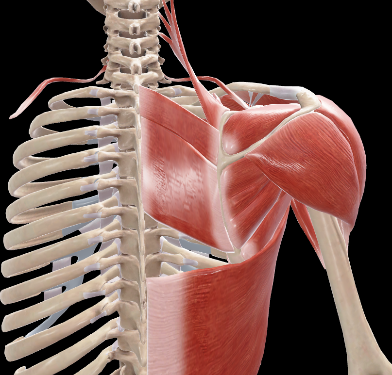
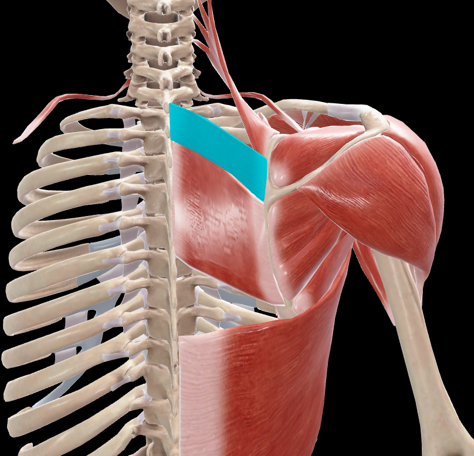

# Romboides Menor

> Músculo aplanado y cuadrilátero situado superior al romboides mayor

#musculo #cintura-pectoral #escapula

## 📋 Datos Clave
- **Grupo:** Músculos profundos de la espalda
- **Función principal:** Retracción y elevación de la escápula
- **Inervación:** [[Nervio dorsal de la escápula]] (C4-C5)

## 📷 Imágenes de Referencia

*Vista posterior del músculo*

*Vista posterior seleccionada*

## Origen
[por completar - según Rouvier]

## Inserción
[por completar - según Rouvier]

## Relaciones
- Situado profundamente al músculo trapecio
- Superior al músculo romboides mayor
- Inferior al músculo elevador de la escápula
- Forma parte de la capa profunda de los músculos de la espalda

## Vascularización
- Arteria dorsal de la escápula
- Arterias intercostales

## Inervación
- Nervio dorsal de la escápula (C4-C5)
- Rama del plexo braquial

## Funciones
1. **Retracción de la escápula:** Aproxima la escápula a la línea media
2. **Elevación de la escápula:** Eleva el hombro
3. **Rotación de la escápula:** Gira la escápula para deprimir el hombro
4. **Fijación de la escápula:** Mantiene la escápula aplicada contra el tórax

## Características especiales
- Trabaja en sinergia con el músculo romboides mayor
- Forma parte del grupo de músculos que fijan la escápula al tronco
- Participa en movimientos de retracción y elevación de los hombros
- Más pequeño que el romboides mayor

## 🔗 Fuente
- Rouvier-Anatomía Humana, Tomo 3