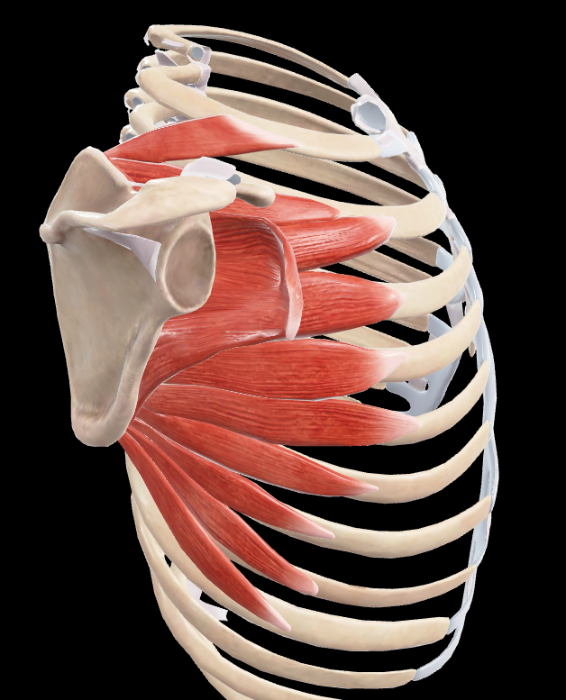
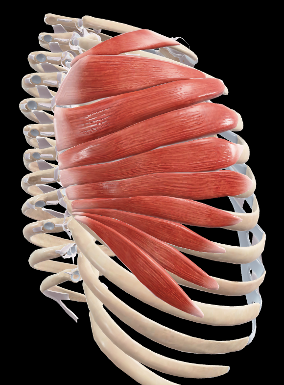
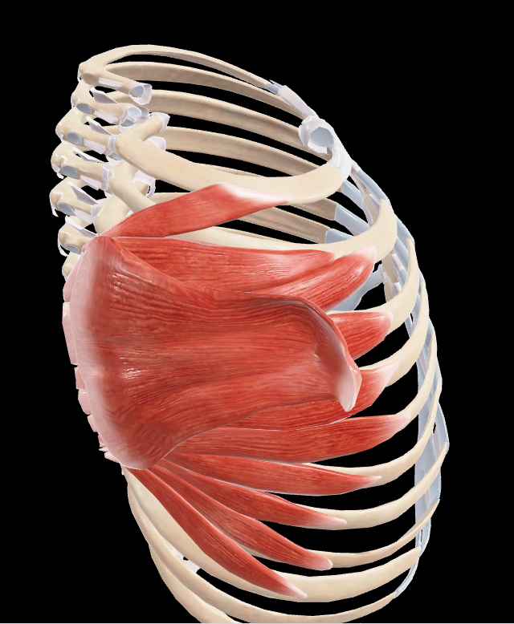
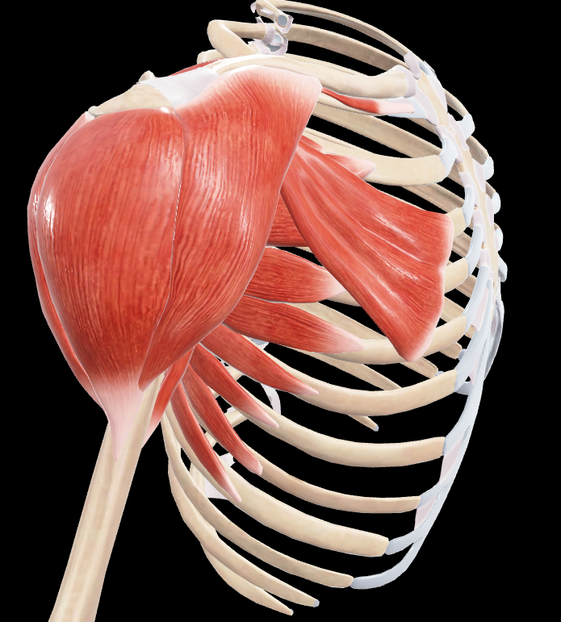
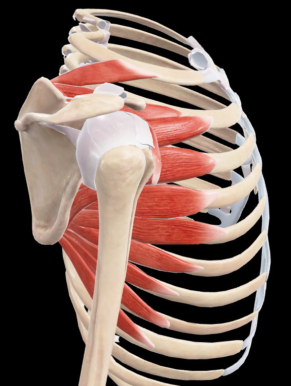

# Serrato Anterior

> Músculo ancho, aplanado, delgado y cuadrilátero aplicado a la pared lateral del tórax

#musculo #cintura-pectoral #axila

## 📋 Datos Clave
- **Grupo:** Músculos de la cintura escapular
- **Función principal:** Protracción y rotación de la escápula
- **Inervación:** [[Nervio torácico largo]] (C5-C7)

## 📷 Imágenes de Referencia

*Vista con escápula*

*Vista aislada del músculo*

*Vista con subescapular*

*Vista tapada*

*Vista con todos los huesos*

## Origen
**Inserciones costales mediante distintas digitaciones:**
1. **Porción superior:** 
   - Borde lateral de la primera costilla (inserción inconstante)
   - Cara externa de la segunda costilla
   - Arco fascial intermedio a dichas inserciones óseas

2. **Porción media:** 
   - Cara externa de las costillas segunda, tercera y cuarta
   - Siguiendo una línea oblicua inferior y anterior

3. **Porción inferior:**
   - Cara externa de las costillas quinta a décima
   - Por medio de seis digitaciones distintas que encajan con las digitaciones del músculo oblicuo externo del abdomen

## Inserción
1. **Porción superior:** 
   - Pequeña carilla triangular, larga y estrecha en el ángulo superomedial de la cara anterior de la escápula

2. **Porción media:**
   - Casi toda la extensión del labio anterior del borde medial de la escápula
   - Por medio de cortas fibras tendinosas

3. **Porción inferior:**
   - Pequeña carilla triangular alargada de superior a inferior
   - Situada en la parte inferomedial de la cara anterior de la escápula

## Relaciones
- Aplicado a la pared lateral del tórax
- Separado de la pared torácica por el espacio celular toracodentado
- Anterior a la escápula
- Posterior a los músculos pectorales

## Vascularización
- Arteria torácica lateral
- Arterias intercostales
- Arteria toracodorsal

## Inervación
- Nervio torácico largo (C5-C7)
- Rama del plexo braquial

## Funciones
1. **Protracción de la escápula:** Desplaza la escápula anterior y lateralmente
2. **Rotación de la escápula:** Gira la escápula para elevar el hombro
3. **Fijación de la escápula:** Mantiene la escápula aplicada contra el tórax
4. **Inspiración forzada:** Eleva las costillas cuando la escápula está fija

## Características especiales
- También conocido como "serrato mayor"
- Presenta digitaciones que se insertan en las costillas
- Forma la pared medial de la axila
- Su parálisis produce "escápula alada"
- Participa en movimientos de empuje y lanzamiento
- Es esencial para la abducción del brazo más allá de 90°

## 🔗 Fuente
- Rouvier-Anatomía Humana, Tomo 3

## 🔗 Enlaces
- [[Fascia del serrato anterior]]
- [[Nervio torácico largo]]