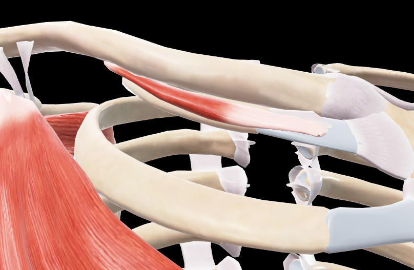

# Subclavio

> Pequeño músculo cilíndrico situado debajo de la clavícula

#musculo #cintura-pectoral #hombro

## 📋 Datos Clave
- **Grupo:** Músculos del tórax
- **Función principal:** Depresión y estabilización de la clavícula
- **Inervación:** [[Nervio subclavio]]

## 📷 Imágenes de Referencia

*Vista anterior del subclavio*

## Origen
- Primera costilla (unión condrocostal)

## Inserción
- Cara inferior de la clavícula (tercio medio)

## Relaciones
- Entre la clavícula y la primera costilla
- Profundo a [[Pectoral Mayor]]
- La [[Vena subclavia]] pasa posterior al músculo
- La [[Arteria subclavia]] pasa posterior al músculo

## Vascularización
- [[Arteria toracoacromial]] (rama clavicular)
- [[Arteria torácica superior]]

## Inervación
- [[Nervio subclavio]] (C5-C6)

## Funciones
- Depresión de la clavícula
- Estabilización de la articulación esternoclavicular
- Protección de los vasos subclavios
- Asistencia en la respiración (fijación de la clavícula)

## 🔗 Fuente
- Rouvier-Anatomía Humana, Tomo 3