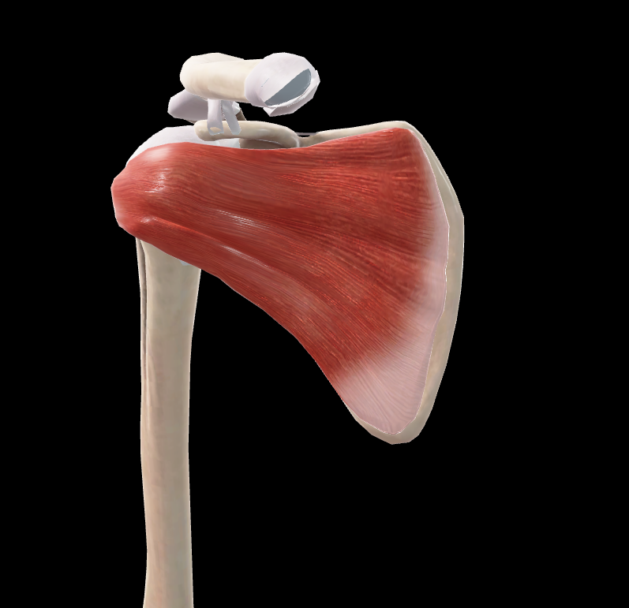
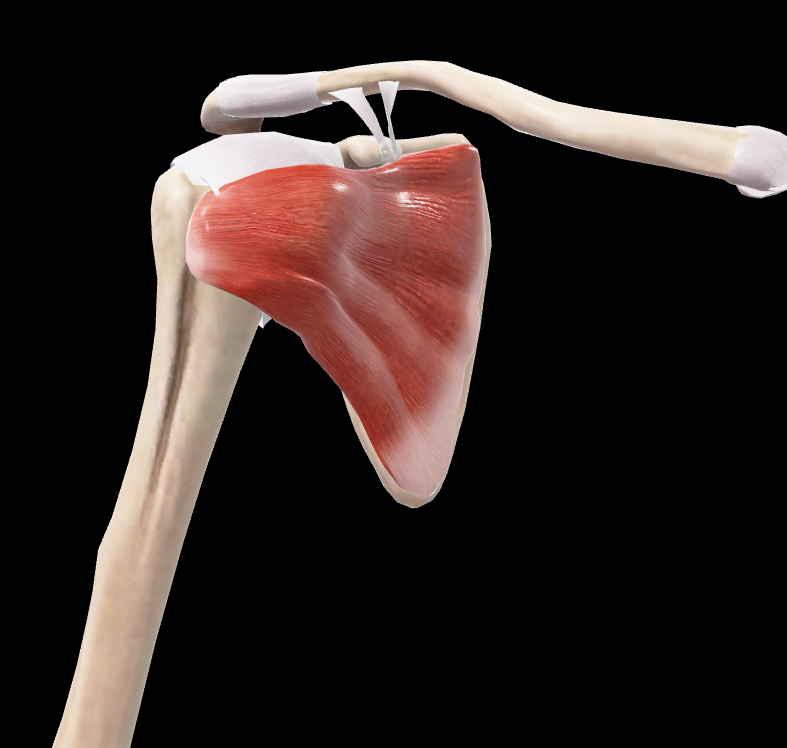

# Subescapular

> Músculo grande y triangular que ocupa la fosa subescapular

## 📋 Datos Clave
- **Grupo:** Músculos del manguito rotador

#musculo #cintura-pectoral #escapula #hombro

#musculo #cintura-pectoral #escapula #hombro

#musculo #cintura-pectoral #escapula #hombro

- **Función principal:** Rotación medial del brazo
- **Inervación:** [[Nervio subescapular superior]] e [[inferior]]

#musculo #cintura-pectoral #escapula #hombro

## 📷 Imágenes de Referencia

*Vista anterior del subescapular*

*Vista lateral-anterior del subescapular*

## Origen
- Fosa subescapular de la escápula

## Inserción
- Tubérculo menor del húmero
- Cápsula de la articulación glenohumeral

## Relaciones
- Entre la escápula y las costillas
- Anterior a [[Serrato Anterior]]
- Forma la pared posterior de la axila

## Vascularización
- [[Arteria subescapular]]
- [[Arteria circunfleja escapular]]

## Inervación
- [[Nervio subescapular superior]] (C5-C6)
- [[Nervio subescapular inferior]] (C5-C6)

## Funciones
- Rotación medial del brazo
- Aducción del brazo
- Estabilización de la articulación glenohumeral
- Previene la luxación anterior del húmero

## 🔗 Fuente
- Rouvier-Anatomía Humana, Tomo 3

## 🔗 Enlaces
- [[Fascia del subescapular]]
- [[Nervio subescapular superior]]
- [[Nervio subescapular inferior]]