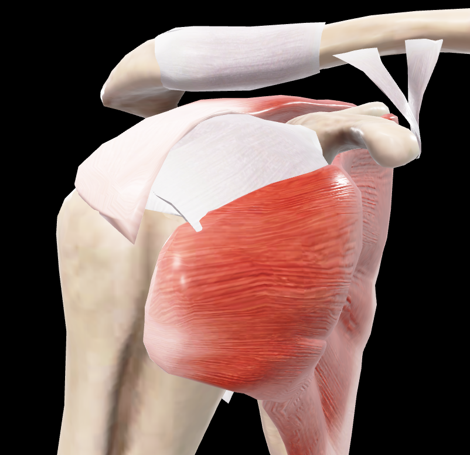
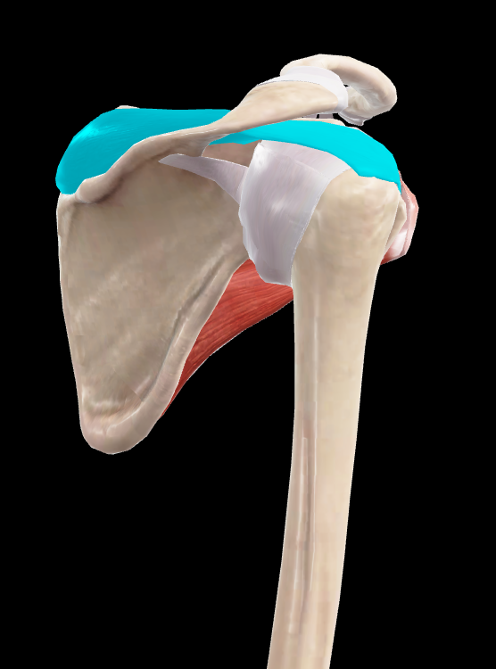
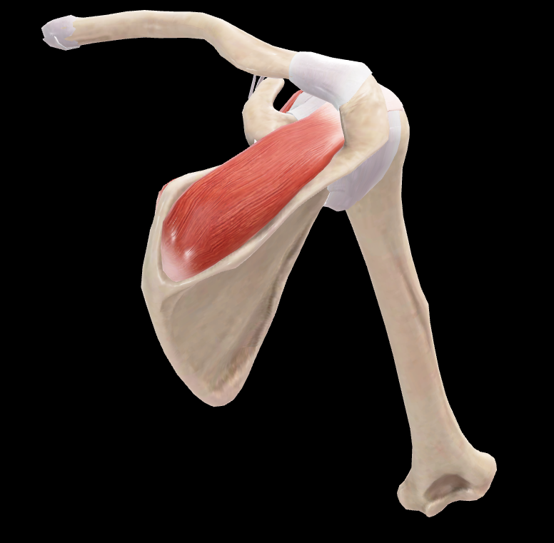

# Supraespinoso

> Músculo que ocupa la fosa supraespinosa de la escápula

#musculo #cintura-pectoral #escapula #hombro

## 📋 Datos Clave
- **Grupo:** Músculos del manguito rotador
- **Función principal:** Abducción del brazo (primeros 15°)
- **Inervación:** [[Nervio supraescapular]]

## 📷 Imágenes de Referencia

*Inserción lateral-anterior del supraespinoso*

*Vista posterior-lateral seleccionada*

*Vista posterior-superior oblicua*

## Origen
- Fosa supraespinosa de la escápula
- Fascia que cubre el músculo

## Inserción
- Faceta superior del tubérculo mayor del húmero
- Cápsula de la articulación glenohumeral

## Relaciones
- Ocupa la fosa supraespinosa
- Cubierto por el [[Trapecio]]
- Relacionado con [[Infraespinoso]] inferiormente

## Vascularización
- [[Arteria supraescapular]]
- [[Arteria circunfleja escapular]]

## Inervación
- [[Nervio supraescapular]] (C4-C6)

## Funciones
- Inicia la abducción del brazo (primeros 15°)
- Estabiliza la cabeza humeral en la cavidad glenoidea
- Asiste en la rotación lateral del brazo
- Previene la subluxación inferior del húmero

## 🔗 Fuente
- Rouvier-Anatomía Humana, Tomo 3