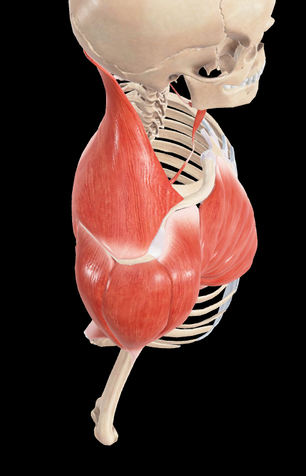
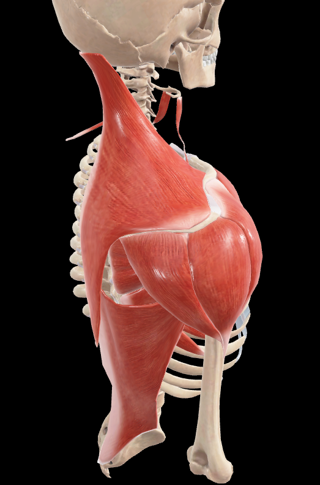
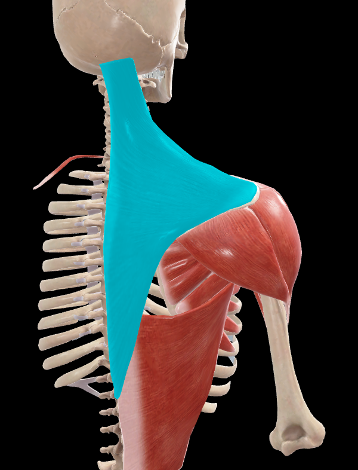

# Trapecio

> Músculo ancho, aplanado, delgado y triangular, el más superficial de la región posterior del cuello y tronco

#musculo #cintura-pectoral #escapula

## 📋 Datos Clave
- **Grupo:** Músculos superficiales de la espalda
- **Función principal:** Movimientos de la cintura escapular y cabeza
- **Inervación:** [[Nervio accesorio]] (XI par craneal) y ramos de C3-C4

## 📷 Imágenes de Referencia

*Vista lateral superior del músculo*

*Vista lateral superior oblicua*

*Vista posterior seleccionada*

## Origen
1. **Tercio medial de la línea nucal superior** y protuberancia occipital externa
2. **Borde posterior del ligamento nucal**
3. **Vértice de las apófisis espinosas** de la séptima vértebra cervical y de las diez primeras vértebras torácicas (a veces hasta doce)
4. **Ligamentos interespinosos** correspondientes

## Inserción
Las fibras musculares convergen lateralmente para terminar en:

**Fibras superiores** (oblicuas inferior y lateralmente):
- Tercio lateral del borde posterior de la clavícula
- Parte próxima de su cara superior

**Fibras medias** (transversales):
- Acromion
- Vertiente superior del borde posterior de la espina de la escápula
- Especialmente amplia sobre el tubérculo del músculo deltoides

**Fibras inferiores** (oblicuas superior y lateralmente):
- Pequeña lámina tendinosa triangular que se desliza sobre la cara triangular del extremo medial de la espina de la escápula
- Se introduce profundamente a las fibras transversales de la porción media
- Se inserta en la parte medial del borde posterior de la espina hasta el tubérculo del músculo deltoides

## Relaciones
- Recubre superiormente los músculos de la nuca
- Recubre inferiormente el músculo romboides y la porción superior del músculo dorsal ancho
- Su borde anterosuperior está adosado al borde posterior del músculo esternocleidomastoideo
- Limita el triángulo lateral del cuello

## Vascularización
- Arteria dorsal de la escápula (rama subtrapezoidea)
- Arteria cervical transversa
- Arteria occipital
- Ramas de las arterias intercostales

## Inervación
- **Principal:** Nervio accesorio (XI par craneal)
- **Sensitiva:** Ramos de C3-C4
- El nervio accesorio se hace profundo al músculo trapecio y termina en él

## Funciones
**Con punto fijo en la columna vertebral:**
1. **Fibras superiores:** Elevan el hombro y lo mueven medialmente
2. **Fibras medias:** Retraen la escápula (aducción) y la rotan para elevar el hombro
3. **Fibras inferiores:** Deprimen la escápula y la rotan para elevar el hombro

**Con punto fijo en la cintura escapular:**
1. **Fibras superiores:** Inclinan la cabeza hacia el lado contraído y la rotan hacia el lado opuesto
2. **Fascículos inferiores:** Contribuyen a elevar el tronco

## Características especiales
- Forma un rombo aponeurótico con el del lado opuesto en la región cervicotorácica
- Considerado el "ligamento suspensorio" de la escápula
- Participa activamente en los mecanismos de la inspiración forzada
- Es el músculo más superficial de la región posterior del cuello y tronco
- Su acción conjunta con otros músculos permite movimientos complejos de la cintura escapular

## 🔗 Fuente
- Rouvier-Anatomía Humana, Tomo 1