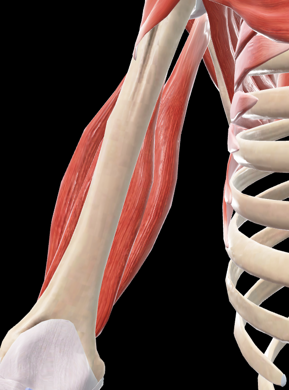
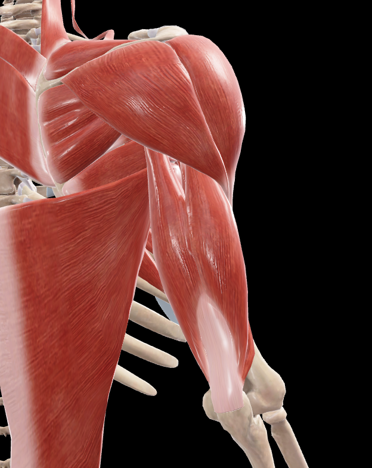
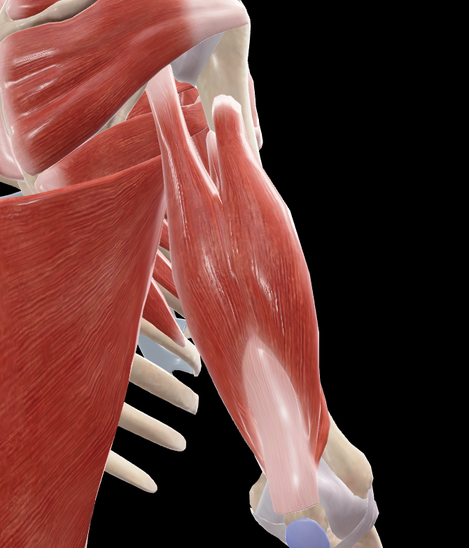
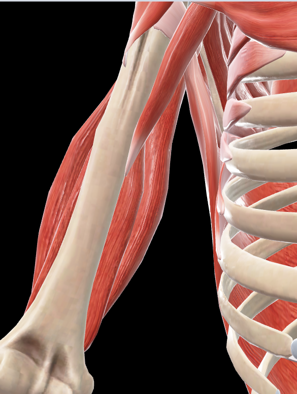

# Tríceps Braquial

> Músculo voluminoso que ocupa la región posterior del brazo, con tres cabezas de origen

#musculo #cintura-pectoral #brazo

## 📋 Datos Clave
- **Grupo:** Músculos posteriores del brazo
- **Función principal:** Extensor del antebrazo sobre el brazo
- **Inervación:** [[Nervio radial]]

## 📷 Imágenes de Referencia

 
        $m = # Tríceps Braquial

> Músculo voluminoso que ocupa la región posterior del brazo, con tres cabezas de origen

#musculo #cintura-pectoral #brazo

## 📋 Datos Clave
- **Grupo:** Músculos posteriores del brazo
- **Función principal:** Extensor del antebrazo sobre el brazo
- **Inervación:** [[Nervio radial]]

## 📷 Imágenes de Referencia

*Vista anterior del músculo*

*Vista anterior tapada*

*Vista posterior del músculo*

*Vista posterior tapada*

## Origen
**Cabeza larga:**
- Tubérculo infraglenoideo de la escápula
- Extremo superior del borde lateral de la escápula
- Parte vecina del rodete glenoideo mediante un tendón aplanado

**Cabeza lateral:**
- Cara posterior del húmero superior y lateralmente al surco del nervio radial
- Cara posterior del húmero inmediatamente inferior al extremo inferior y lateral del surco del nervio radial (inconstante)

**Cabeza medial:**
- Cara posterior del húmero inferior y medialmente al surco del nervio radial
- Tabique intermuscular medial del brazo
- Tabique intermuscular lateral del brazo

## Inserción
- **Tendón común aplanado:** Se fija en la parte posterior de la cara superior del olécranon del cúbito
- Las tres cabezas convergen hacia un tendón común que se observa a partir de la parte media de la cara posterior del músculo

## Relaciones
- **Cabeza larga:** Atraviesa el espacio escapulohumeral entre los músculos redondo mayor y redondo menor
- **Cabeza lateral:** Pasa posterior al surco del nervio radial, convirtiéndolo en un conducto osteomuscular para el nervio radial y la arteria braquial profunda
- Las tres cabezas se reúnen y terminan en un ancho tendón que se fija al olécranon
- La cabeza larga divide el espacio escapulohumeral en dos partes

## Vascularización
- Arteria braquial profunda
- Arteria colateral cubital superior
- Arteria colateral cubital inferior
- Arteria colateral radial
- Arteria interósea recurrente

## Inervación
- Nervio radial (C5-C8)
- Cada cabeza recibe ramos específicos del nervio radial

## Funciones
1. **Extensión del antebrazo:** Sobre el brazo (acción principal)
2. **Extensión del brazo:** La cabeza larga participa en la extensión del brazo sobre el hombro
3. **Aducción del brazo:** La cabeza larga participa en la aducción del brazo
4. **Estabilización:** De la articulación del codo y hombro

## Características especiales
- Músculo más voluminoso del brazo
- La cabeza larga es biarticular (cruza hombro y codo)
- Las cabezas lateral y medial son monoarticulares (solo actúan sobre el codo)
- Considerado el principal extensor del codo
- Su potencia es considerable: cabeza larga (6,8 kg), cabezas lateral y medial (6,1 kg total)

## 🔗 Fuente
- Rouvier-Anatomía Humana, Tomo 3
.Value
        $alt = $m.Substring(2, $m.Length-3)
        $cleanAlt = $alt -replace '\.png(imgs/musculos/Triceps_braquial_anterior.png)
*Vista anterior del músculo*

*Vista anterior tapada*

*Vista posterior del músculo*

*Vista posterior tapada*

## Origen
**Cabeza larga:**
- Tubérculo infraglenoideo de la escápula
- Extremo superior del borde lateral de la escápula
- Parte vecina del rodete glenoideo mediante un tendón aplanado

**Cabeza lateral:**
- Cara posterior del húmero superior y lateralmente al surco del nervio radial
- Cara posterior del húmero inmediatamente inferior al extremo inferior y lateral del surco del nervio radial (inconstante)

**Cabeza medial:**
- Cara posterior del húmero inferior y medialmente al surco del nervio radial
- Tabique intermuscular medial del brazo
- Tabique intermuscular lateral del brazo

## Inserción
- **Tendón común aplanado:** Se fija en la parte posterior de la cara superior del olécranon del cúbito
- Las tres cabezas convergen hacia un tendón común que se observa a partir de la parte media de la cara posterior del músculo

## Relaciones
- **Cabeza larga:** Atraviesa el espacio escapulohumeral entre los músculos redondo mayor y redondo menor
- **Cabeza lateral:** Pasa posterior al surco del nervio radial, convirtiéndolo en un conducto osteomuscular para el nervio radial y la arteria braquial profunda
- Las tres cabezas se reúnen y terminan en un ancho tendón que se fija al olécranon
- La cabeza larga divide el espacio escapulohumeral en dos partes

## Vascularización
- Arteria braquial profunda
- Arteria colateral cubital superior
- Arteria colateral cubital inferior
- Arteria colateral radial
- Arteria interósea recurrente

## Inervación
- Nervio radial (C5-C8)
- Cada cabeza recibe ramos específicos del nervio radial

## Funciones
1. **Extensión del antebrazo:** Sobre el brazo (acción principal)
2. **Extensión del brazo:** La cabeza larga participa en la extensión del brazo sobre el hombro
3. **Aducción del brazo:** La cabeza larga participa en la aducción del brazo
4. **Estabilización:** De la articulación del codo y hombro

## Características especiales
- Músculo más voluminoso del brazo
- La cabeza larga es biarticular (cruza hombro y codo)
- Las cabezas lateral y medial son monoarticulares (solo actúan sobre el codo)
- Considerado el principal extensor del codo
- Su potencia es considerable: cabeza larga (6,8 kg), cabezas lateral y medial (6,1 kg total)

## 🔗 Fuente
- Rouvier-Anatomía Humana, Tomo 3
, ''
        "![$cleanAlt]"
    (imgs/musculos/Triceps_braquial_anterior.png)
*Vista anterior del músculo*

 
        $m = # Tríceps Braquial

> Músculo voluminoso que ocupa la región posterior del brazo, con tres cabezas de origen

#musculo #cintura-pectoral #brazo

## 📋 Datos Clave
- **Grupo:** Músculos posteriores del brazo
- **Función principal:** Extensor del antebrazo sobre el brazo
- **Inervación:** [[Nervio radial]]

## 📷 Imágenes de Referencia

*Vista anterior del músculo*

*Vista anterior tapada*

*Vista posterior del músculo*

*Vista posterior tapada*

## Origen
**Cabeza larga:**
- Tubérculo infraglenoideo de la escápula
- Extremo superior del borde lateral de la escápula
- Parte vecina del rodete glenoideo mediante un tendón aplanado

**Cabeza lateral:**
- Cara posterior del húmero superior y lateralmente al surco del nervio radial
- Cara posterior del húmero inmediatamente inferior al extremo inferior y lateral del surco del nervio radial (inconstante)

**Cabeza medial:**
- Cara posterior del húmero inferior y medialmente al surco del nervio radial
- Tabique intermuscular medial del brazo
- Tabique intermuscular lateral del brazo

## Inserción
- **Tendón común aplanado:** Se fija en la parte posterior de la cara superior del olécranon del cúbito
- Las tres cabezas convergen hacia un tendón común que se observa a partir de la parte media de la cara posterior del músculo

## Relaciones
- **Cabeza larga:** Atraviesa el espacio escapulohumeral entre los músculos redondo mayor y redondo menor
- **Cabeza lateral:** Pasa posterior al surco del nervio radial, convirtiéndolo en un conducto osteomuscular para el nervio radial y la arteria braquial profunda
- Las tres cabezas se reúnen y terminan en un ancho tendón que se fija al olécranon
- La cabeza larga divide el espacio escapulohumeral en dos partes

## Vascularización
- Arteria braquial profunda
- Arteria colateral cubital superior
- Arteria colateral cubital inferior
- Arteria colateral radial
- Arteria interósea recurrente

## Inervación
- Nervio radial (C5-C8)
- Cada cabeza recibe ramos específicos del nervio radial

## Funciones
1. **Extensión del antebrazo:** Sobre el brazo (acción principal)
2. **Extensión del brazo:** La cabeza larga participa en la extensión del brazo sobre el hombro
3. **Aducción del brazo:** La cabeza larga participa en la aducción del brazo
4. **Estabilización:** De la articulación del codo y hombro

## Características especiales
- Músculo más voluminoso del brazo
- La cabeza larga es biarticular (cruza hombro y codo)
- Las cabezas lateral y medial son monoarticulares (solo actúan sobre el codo)
- Considerado el principal extensor del codo
- Su potencia es considerable: cabeza larga (6,8 kg), cabezas lateral y medial (6,1 kg total)

## 🔗 Fuente
- Rouvier-Anatomía Humana, Tomo 3
.Value
        $alt = $m.Substring(2, $m.Length-3)
        $cleanAlt = $alt -replace '\.png(imgs/musculos/Triceps_braquial_anterior_tapado.png)
*Vista anterior tapada*

*Vista posterior del músculo*

*Vista posterior tapada*

## Origen
**Cabeza larga:**
- Tubérculo infraglenoideo de la escápula
- Extremo superior del borde lateral de la escápula
- Parte vecina del rodete glenoideo mediante un tendón aplanado

**Cabeza lateral:**
- Cara posterior del húmero superior y lateralmente al surco del nervio radial
- Cara posterior del húmero inmediatamente inferior al extremo inferior y lateral del surco del nervio radial (inconstante)

**Cabeza medial:**
- Cara posterior del húmero inferior y medialmente al surco del nervio radial
- Tabique intermuscular medial del brazo
- Tabique intermuscular lateral del brazo

## Inserción
- **Tendón común aplanado:** Se fija en la parte posterior de la cara superior del olécranon del cúbito
- Las tres cabezas convergen hacia un tendón común que se observa a partir de la parte media de la cara posterior del músculo

## Relaciones
- **Cabeza larga:** Atraviesa el espacio escapulohumeral entre los músculos redondo mayor y redondo menor
- **Cabeza lateral:** Pasa posterior al surco del nervio radial, convirtiéndolo en un conducto osteomuscular para el nervio radial y la arteria braquial profunda
- Las tres cabezas se reúnen y terminan en un ancho tendón que se fija al olécranon
- La cabeza larga divide el espacio escapulohumeral en dos partes

## Vascularización
- Arteria braquial profunda
- Arteria colateral cubital superior
- Arteria colateral cubital inferior
- Arteria colateral radial
- Arteria interósea recurrente

## Inervación
- Nervio radial (C5-C8)
- Cada cabeza recibe ramos específicos del nervio radial

## Funciones
1. **Extensión del antebrazo:** Sobre el brazo (acción principal)
2. **Extensión del brazo:** La cabeza larga participa en la extensión del brazo sobre el hombro
3. **Aducción del brazo:** La cabeza larga participa en la aducción del brazo
4. **Estabilización:** De la articulación del codo y hombro

## Características especiales
- Músculo más voluminoso del brazo
- La cabeza larga es biarticular (cruza hombro y codo)
- Las cabezas lateral y medial son monoarticulares (solo actúan sobre el codo)
- Considerado el principal extensor del codo
- Su potencia es considerable: cabeza larga (6,8 kg), cabezas lateral y medial (6,1 kg total)

## 🔗 Fuente
- Rouvier-Anatomía Humana, Tomo 3
, ''
        "![$cleanAlt]"
    (imgs/musculos/Triceps_braquial_anterior_tapado.png)
*Vista anterior tapada*

 
        $m = # Tríceps Braquial

> Músculo voluminoso que ocupa la región posterior del brazo, con tres cabezas de origen

#musculo #cintura-pectoral #brazo

## 📋 Datos Clave
- **Grupo:** Músculos posteriores del brazo
- **Función principal:** Extensor del antebrazo sobre el brazo
- **Inervación:** [[Nervio radial]]

## 📷 Imágenes de Referencia

*Vista anterior del músculo*

*Vista anterior tapada*

*Vista posterior del músculo*

*Vista posterior tapada*

## Origen
**Cabeza larga:**
- Tubérculo infraglenoideo de la escápula
- Extremo superior del borde lateral de la escápula
- Parte vecina del rodete glenoideo mediante un tendón aplanado

**Cabeza lateral:**
- Cara posterior del húmero superior y lateralmente al surco del nervio radial
- Cara posterior del húmero inmediatamente inferior al extremo inferior y lateral del surco del nervio radial (inconstante)

**Cabeza medial:**
- Cara posterior del húmero inferior y medialmente al surco del nervio radial
- Tabique intermuscular medial del brazo
- Tabique intermuscular lateral del brazo

## Inserción
- **Tendón común aplanado:** Se fija en la parte posterior de la cara superior del olécranon del cúbito
- Las tres cabezas convergen hacia un tendón común que se observa a partir de la parte media de la cara posterior del músculo

## Relaciones
- **Cabeza larga:** Atraviesa el espacio escapulohumeral entre los músculos redondo mayor y redondo menor
- **Cabeza lateral:** Pasa posterior al surco del nervio radial, convirtiéndolo en un conducto osteomuscular para el nervio radial y la arteria braquial profunda
- Las tres cabezas se reúnen y terminan en un ancho tendón que se fija al olécranon
- La cabeza larga divide el espacio escapulohumeral en dos partes

## Vascularización
- Arteria braquial profunda
- Arteria colateral cubital superior
- Arteria colateral cubital inferior
- Arteria colateral radial
- Arteria interósea recurrente

## Inervación
- Nervio radial (C5-C8)
- Cada cabeza recibe ramos específicos del nervio radial

## Funciones
1. **Extensión del antebrazo:** Sobre el brazo (acción principal)
2. **Extensión del brazo:** La cabeza larga participa en la extensión del brazo sobre el hombro
3. **Aducción del brazo:** La cabeza larga participa en la aducción del brazo
4. **Estabilización:** De la articulación del codo y hombro

## Características especiales
- Músculo más voluminoso del brazo
- La cabeza larga es biarticular (cruza hombro y codo)
- Las cabezas lateral y medial son monoarticulares (solo actúan sobre el codo)
- Considerado el principal extensor del codo
- Su potencia es considerable: cabeza larga (6,8 kg), cabezas lateral y medial (6,1 kg total)

## 🔗 Fuente
- Rouvier-Anatomía Humana, Tomo 3
.Value
        $alt = $m.Substring(2, $m.Length-3)
        $cleanAlt = $alt -replace '\.png(imgs/musculos/Triceps_braquial_posterior.png)
*Vista posterior del músculo*

*Vista posterior tapada*

## Origen
**Cabeza larga:**
- Tubérculo infraglenoideo de la escápula
- Extremo superior del borde lateral de la escápula
- Parte vecina del rodete glenoideo mediante un tendón aplanado

**Cabeza lateral:**
- Cara posterior del húmero superior y lateralmente al surco del nervio radial
- Cara posterior del húmero inmediatamente inferior al extremo inferior y lateral del surco del nervio radial (inconstante)

**Cabeza medial:**
- Cara posterior del húmero inferior y medialmente al surco del nervio radial
- Tabique intermuscular medial del brazo
- Tabique intermuscular lateral del brazo

## Inserción
- **Tendón común aplanado:** Se fija en la parte posterior de la cara superior del olécranon del cúbito
- Las tres cabezas convergen hacia un tendón común que se observa a partir de la parte media de la cara posterior del músculo

## Relaciones
- **Cabeza larga:** Atraviesa el espacio escapulohumeral entre los músculos redondo mayor y redondo menor
- **Cabeza lateral:** Pasa posterior al surco del nervio radial, convirtiéndolo en un conducto osteomuscular para el nervio radial y la arteria braquial profunda
- Las tres cabezas se reúnen y terminan en un ancho tendón que se fija al olécranon
- La cabeza larga divide el espacio escapulohumeral en dos partes

## Vascularización
- Arteria braquial profunda
- Arteria colateral cubital superior
- Arteria colateral cubital inferior
- Arteria colateral radial
- Arteria interósea recurrente

## Inervación
- Nervio radial (C5-C8)
- Cada cabeza recibe ramos específicos del nervio radial

## Funciones
1. **Extensión del antebrazo:** Sobre el brazo (acción principal)
2. **Extensión del brazo:** La cabeza larga participa en la extensión del brazo sobre el hombro
3. **Aducción del brazo:** La cabeza larga participa en la aducción del brazo
4. **Estabilización:** De la articulación del codo y hombro

## Características especiales
- Músculo más voluminoso del brazo
- La cabeza larga es biarticular (cruza hombro y codo)
- Las cabezas lateral y medial son monoarticulares (solo actúan sobre el codo)
- Considerado el principal extensor del codo
- Su potencia es considerable: cabeza larga (6,8 kg), cabezas lateral y medial (6,1 kg total)

## 🔗 Fuente
- Rouvier-Anatomía Humana, Tomo 3
, ''
        "![$cleanAlt]"
    (imgs/musculos/Triceps_braquial_posterior.png)
*Vista posterior del músculo*

 
        $m = # Tríceps Braquial

> Músculo voluminoso que ocupa la región posterior del brazo, con tres cabezas de origen

#musculo #cintura-pectoral #brazo

## 📋 Datos Clave
- **Grupo:** Músculos posteriores del brazo
- **Función principal:** Extensor del antebrazo sobre el brazo
- **Inervación:** [[Nervio radial]]

## 📷 Imágenes de Referencia

*Vista anterior del músculo*

*Vista anterior tapada*

*Vista posterior del músculo*

*Vista posterior tapada*

## Origen
**Cabeza larga:**
- Tubérculo infraglenoideo de la escápula
- Extremo superior del borde lateral de la escápula
- Parte vecina del rodete glenoideo mediante un tendón aplanado

**Cabeza lateral:**
- Cara posterior del húmero superior y lateralmente al surco del nervio radial
- Cara posterior del húmero inmediatamente inferior al extremo inferior y lateral del surco del nervio radial (inconstante)

**Cabeza medial:**
- Cara posterior del húmero inferior y medialmente al surco del nervio radial
- Tabique intermuscular medial del brazo
- Tabique intermuscular lateral del brazo

## Inserción
- **Tendón común aplanado:** Se fija en la parte posterior de la cara superior del olécranon del cúbito
- Las tres cabezas convergen hacia un tendón común que se observa a partir de la parte media de la cara posterior del músculo

## Relaciones
- **Cabeza larga:** Atraviesa el espacio escapulohumeral entre los músculos redondo mayor y redondo menor
- **Cabeza lateral:** Pasa posterior al surco del nervio radial, convirtiéndolo en un conducto osteomuscular para el nervio radial y la arteria braquial profunda
- Las tres cabezas se reúnen y terminan en un ancho tendón que se fija al olécranon
- La cabeza larga divide el espacio escapulohumeral en dos partes

## Vascularización
- Arteria braquial profunda
- Arteria colateral cubital superior
- Arteria colateral cubital inferior
- Arteria colateral radial
- Arteria interósea recurrente

## Inervación
- Nervio radial (C5-C8)
- Cada cabeza recibe ramos específicos del nervio radial

## Funciones
1. **Extensión del antebrazo:** Sobre el brazo (acción principal)
2. **Extensión del brazo:** La cabeza larga participa en la extensión del brazo sobre el hombro
3. **Aducción del brazo:** La cabeza larga participa en la aducción del brazo
4. **Estabilización:** De la articulación del codo y hombro

## Características especiales
- Músculo más voluminoso del brazo
- La cabeza larga es biarticular (cruza hombro y codo)
- Las cabezas lateral y medial son monoarticulares (solo actúan sobre el codo)
- Considerado el principal extensor del codo
- Su potencia es considerable: cabeza larga (6,8 kg), cabezas lateral y medial (6,1 kg total)

## 🔗 Fuente
- Rouvier-Anatomía Humana, Tomo 3
.Value
        $alt = $m.Substring(2, $m.Length-3)
        $cleanAlt = $alt -replace '\.png(imgs/musculos/Triceps_braquial_posterior_tapado.png)
*Vista posterior tapada*

## Origen
**Cabeza larga:**
- Tubérculo infraglenoideo de la escápula
- Extremo superior del borde lateral de la escápula
- Parte vecina del rodete glenoideo mediante un tendón aplanado

**Cabeza lateral:**
- Cara posterior del húmero superior y lateralmente al surco del nervio radial
- Cara posterior del húmero inmediatamente inferior al extremo inferior y lateral del surco del nervio radial (inconstante)

**Cabeza medial:**
- Cara posterior del húmero inferior y medialmente al surco del nervio radial
- Tabique intermuscular medial del brazo
- Tabique intermuscular lateral del brazo

## Inserción
- **Tendón común aplanado:** Se fija en la parte posterior de la cara superior del olécranon del cúbito
- Las tres cabezas convergen hacia un tendón común que se observa a partir de la parte media de la cara posterior del músculo

## Relaciones
- **Cabeza larga:** Atraviesa el espacio escapulohumeral entre los músculos redondo mayor y redondo menor
- **Cabeza lateral:** Pasa posterior al surco del nervio radial, convirtiéndolo en un conducto osteomuscular para el nervio radial y la arteria braquial profunda
- Las tres cabezas se reúnen y terminan en un ancho tendón que se fija al olécranon
- La cabeza larga divide el espacio escapulohumeral en dos partes

## Vascularización
- Arteria braquial profunda
- Arteria colateral cubital superior
- Arteria colateral cubital inferior
- Arteria colateral radial
- Arteria interósea recurrente

## Inervación
- Nervio radial (C5-C8)
- Cada cabeza recibe ramos específicos del nervio radial

## Funciones
1. **Extensión del antebrazo:** Sobre el brazo (acción principal)
2. **Extensión del brazo:** La cabeza larga participa en la extensión del brazo sobre el hombro
3. **Aducción del brazo:** La cabeza larga participa en la aducción del brazo
4. **Estabilización:** De la articulación del codo y hombro

## Características especiales
- Músculo más voluminoso del brazo
- La cabeza larga es biarticular (cruza hombro y codo)
- Las cabezas lateral y medial son monoarticulares (solo actúan sobre el codo)
- Considerado el principal extensor del codo
- Su potencia es considerable: cabeza larga (6,8 kg), cabezas lateral y medial (6,1 kg total)

## 🔗 Fuente
- Rouvier-Anatomía Humana, Tomo 3
, ''
        "![$cleanAlt]"
    (imgs/musculos/Triceps_braquial_posterior_tapado.png)
*Vista posterior tapada*

## Origen
**Cabeza larga:**
- Tubérculo infraglenoideo de la escápula
- Extremo superior del borde lateral de la escápula
- Parte vecina del rodete glenoideo mediante un tendón aplanado

**Cabeza lateral:**
- Cara posterior del húmero superior y lateralmente al surco del nervio radial
- Cara posterior del húmero inmediatamente inferior al extremo inferior y lateral del surco del nervio radial (inconstante)

**Cabeza medial:**
- Cara posterior del húmero inferior y medialmente al surco del nervio radial
- Tabique intermuscular medial del brazo
- Tabique intermuscular lateral del brazo

## Inserción
- **Tendón común aplanado:** Se fija en la parte posterior de la cara superior del olécranon del cúbito
- Las tres cabezas convergen hacia un tendón común que se observa a partir de la parte media de la cara posterior del músculo

## Relaciones
- **Cabeza larga:** Atraviesa el espacio escapulohumeral entre los músculos redondo mayor y redondo menor
- **Cabeza lateral:** Pasa posterior al surco del nervio radial, convirtiéndolo en un conducto osteomuscular para el nervio radial y la arteria braquial profunda
- Las tres cabezas se reúnen y terminan en un ancho tendón que se fija al olécranon
- La cabeza larga divide el espacio escapulohumeral en dos partes

## Vascularización
- Arteria braquial profunda
- Arteria colateral cubital superior
- Arteria colateral cubital inferior
- Arteria colateral radial
- Arteria interósea recurrente

## Inervación
- Nervio radial (C5-C8)
- Cada cabeza recibe ramos específicos del nervio radial

## Funciones
1. **Extensión del antebrazo:** Sobre el brazo (acción principal)
2. **Extensión del brazo:** La cabeza larga participa en la extensión del brazo sobre el hombro
3. **Aducción del brazo:** La cabeza larga participa en la aducción del brazo
4. **Estabilización:** De la articulación del codo y hombro

## Características especiales
- Músculo más voluminoso del brazo
- La cabeza larga es biarticular (cruza hombro y codo)
- Las cabezas lateral y medial son monoarticulares (solo actúan sobre el codo)
- Considerado el principal extensor del codo
- Su potencia es considerable: cabeza larga (6,8 kg), cabezas lateral y medial (6,1 kg total)

## 🔗 Fuente
- Rouvier-Anatomía Humana, Tomo 3
