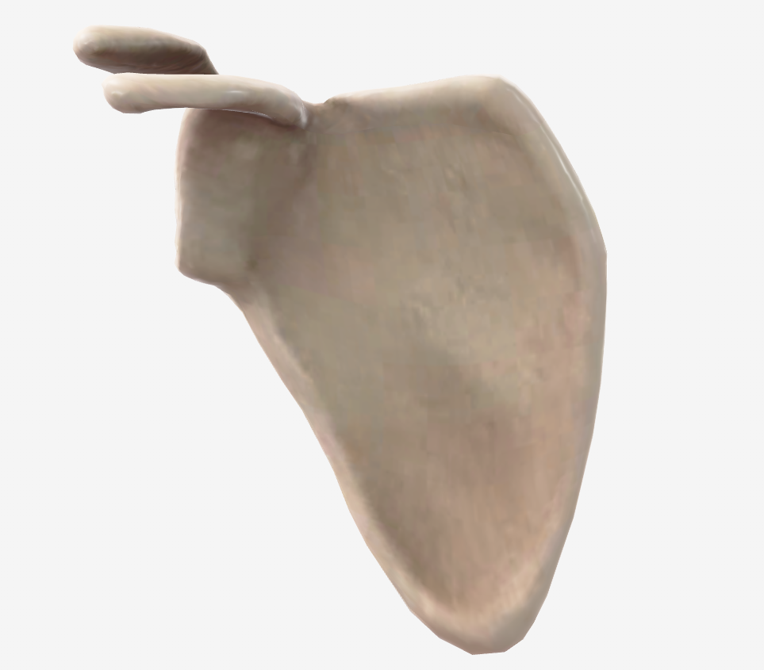
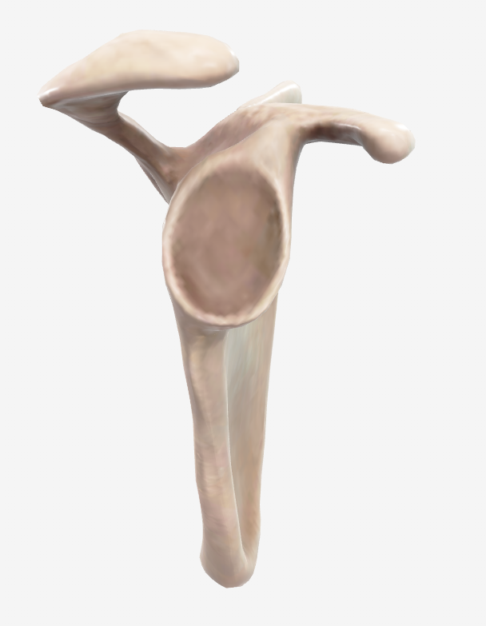
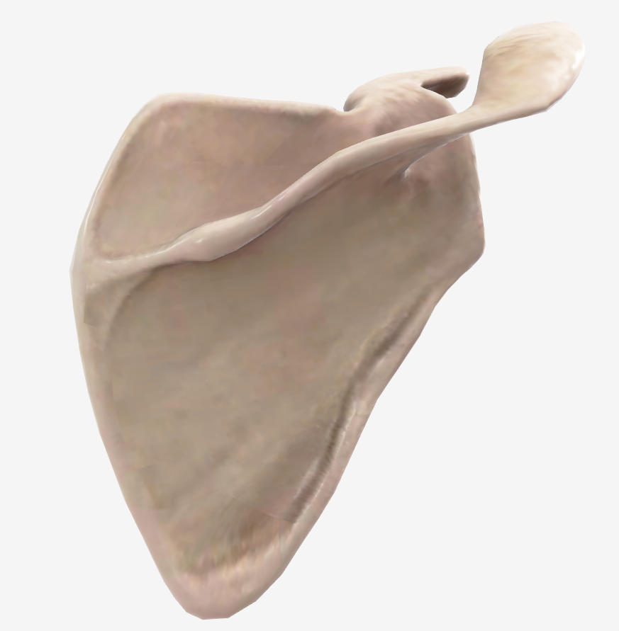

# Escápula

> Descripción breve: hueso plano, ancho, delgado y triangular que se aplica sobre la parte posterior y superior del tórax a la altura de las siete primeras costillas. Forma parte de la cintura escapular. (Rouvier)

## 📋 Datos Clave

- **Tipo:** plano
- **Región:** #cintura-pectoral
- **Elemento del esqueleto:** apendicular
- **Formación:** endoescondral
- **Función principal:** soporte, punto de inserción muscular, movilidad del brazo

#hueso #escapula #hombro

---

## 📷 Imágenes de Referencia

*Vista anterior de la escápula*

*Vista lateral de la escápula*

*Vista posterior de la escápula*

---

## Partes / Accidentes Óseos

### Caras (Rouvier)
- **Cara anterior o cara costal:** excavada en casi toda su extensión, recibe el nombre de **fosa subescapular**. En la unión de su cuarto superior con sus tres cuartas partes inferiores, la depresión es más pronunciada y angulosa.
- **Cara posterior:** dividida en dos partes por la espina de la escápula. Superiormente a la espina se encuentra la **fosa supraespinosa**, e inferiormente la **fosa infraespinosa**.

### Bordes (Rouvier)
- **Borde superior:** corto y delgado. Termina lateralmente en la **escotadura de la escápula**, por la que discurre el nervio supraescapular.
- **Borde medial:** largo, delgado y cóncavo. Se extiende del ángulo superior al ángulo inferior de la escápula.
- **Borde lateral:** grueso, corto y excavado por la cavidad glenoidea en su parte superior.

### Ángulos
- **Ángulo superior:** delgado, romo, dirigido medialmente.
- **Ángulo inferior:** grueso, romo, dirigido inferiormente.
- **Ángulo lateral:** ancho, presenta la cavidad glenoidea.

### Apófisis / Procesos (Rouvier)
- **Acromion:** continuación lateral de la espina de la escápula, aplanado en sentido inverso a la espina. Presenta carilla articular para la clavícula.
- **Proceso coracoides:** apófisis anterior que sirve para inserciones musculares.
- **Espina de la escápula:** lámina ósea triangular implantada transversalmente sobre la cara posterior de la escápula.
- **Cavidad glenoidea:** superficie articular para la cabeza del húmero, ubicada en el ángulo lateral.

### Fosas (Rouvier)
- **Fosa supraespinosa:** canal de superficie lisa, más amplio pero menos profundo medial que lateralmente.
- **Fosa infraespinosa:** dividida por una cresta a lo largo del borde lateral en dos partes principales: medial y lateral.
- **Fosa subescapular:** atravesada por tres o cuatro crestas que irradian desde el cuello de la escápula hacia su borde medial.

---

## Articulaciones

| Extremidad | Articulación          | Tipo       | Movimientos                                       |
| ---------- | --------------------- | ---------- | ------------------------------------------------- |
| Lateral    | [[Glenohumeral]]      | enartrosis | flexión, extensión, abducción, aducción, rotación |
| Superior   | [[Acromioclavicular]] | artrodia   | movimientos de deslizamiento                      |

---

## Inserciones Musculares

### Origen (fijo, menos móvil)
| Músculo | Localización en el hueso |
|---------|-------------------------|
| [[Supraespinoso]] | fosa supraespinosa |
| [[Infraespinoso]] | fosa infraespinosa |
| [[Subescapular]] | fosa subescapular |
| [[Redondo Mayor]] | borde lateral de la escápula |
| [[Redondo Menor]] | borde lateral de la escápula |

### Inserción (más móvil)
| Músculo | Localización en el hueso |
|---------|-------------------------|
| [[Trapecio]] | espina de la escápula, acromion |
| [[Romboides Mayor]] | borde medial de la escápula |
| [[Romboides Menor]] | borde medial de la escápula |
| [[Elevador de la Escápula]] | ángulo superior de la escápula |
| [[Serrato Anterior]] | borde medial de la escápula |

---

## Vascularización

| Arteria | Territorio |
|---------|-----------|
| [[Arteria subclavia]] | ramas escapulares |
| [[Arteria axilar]] | ramas escapulares |

---

## Inervación

| Nervio | Función |
|--------|---------|
| [[Nervio supraescapular]] | músculos supraespinoso e infraespinoso |
| [[Nervio dorsal de la escápula]] | músculos romboides |

---

## Relaciones Anatómicas

- **Anterior:** [[Pulmón]], [[Costillas]]
- **Posterior:** [[Trapecio]], [[Deltoides]], [[Infraespinoso]]
- **Medial:** [[Columna vertebral]]
- **Lateral:** [[Húmero]]
- **Superficial:** [[Trapecio]], [[Deltoides]]
- **Profundo:** [[Costillas]], [[Pulmón]]

---

## Relaciones con Órganos / Vísceras

| Estructura | Relación |
|-----------|----------|
| [[Pulmón]] | anterior a la escápula, separado por la pared torácica |
| [[Costillas]] | anterior a la escápula |

---

## Notas Clínicas

- Fracturas de escápula poco comunes debido a su protección muscular
- Escápula alada: lesión del nervio torácico largo que inerva al serrato anterior
- Síndrome de pinzamiento subacromial: dolor en el espacio entre acromion y cabeza humeral

---

## Tabla de Imágenes

| Imagen | Vista | Descripción |
|--------|-------|-------------|
|  | Anterior | Vista anterior de la escápula |
|  | Lateral | Vista lateral de la escápula |
|  | Posterior | Vista posterior de la escápula |

---

## 🔗 Fuente
- Rouvier-Anatomía Humana, Tomo 3